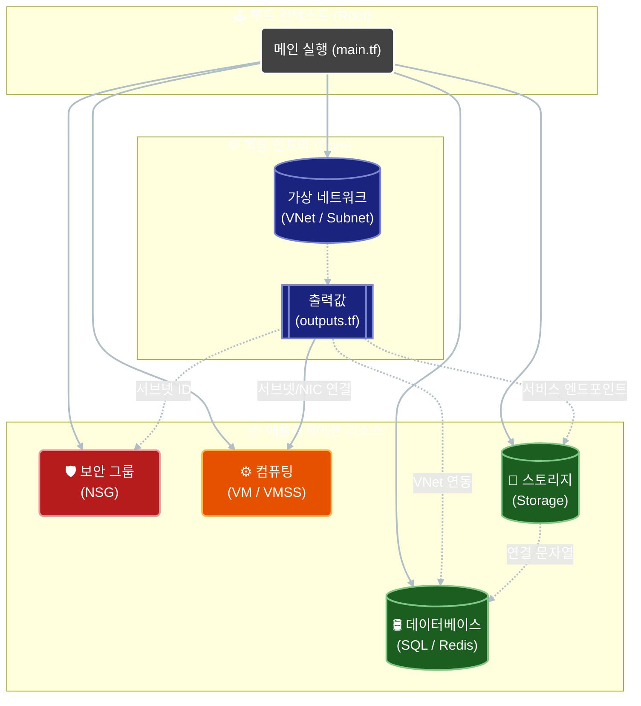
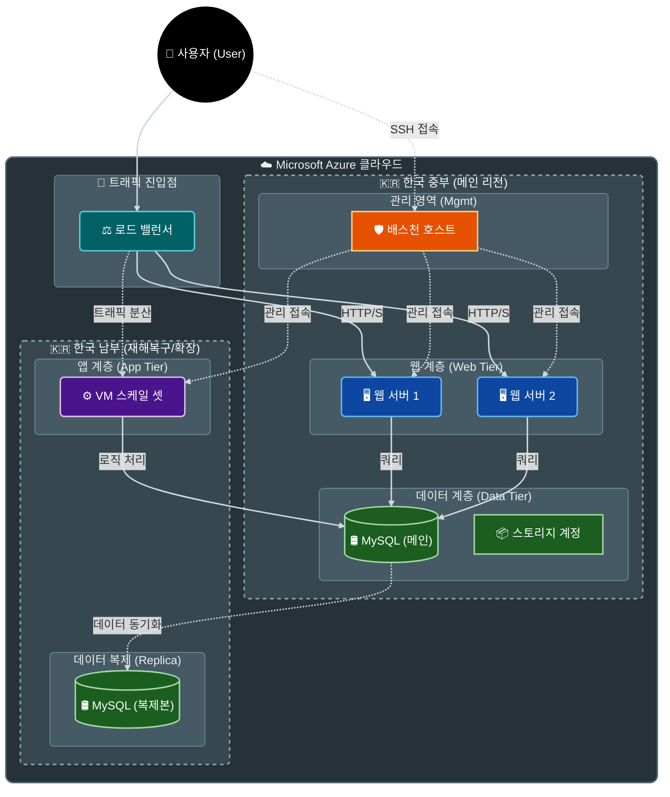

# 코드 리팩토링 및 통합 리포트

## ✅ 개요
여러 명이 작성한 Terraform 코드를 통합하면서 발생한 모듈 간 의존성, 변수 불일치, 리소스 중복 문제들을 해결하고, 체계적인 리팩토링을 통해 유지보수성과 가독성을 대폭 향상시켰습니다. 본 문서는 1차 통합 작업의 배경과 2차 리팩토링의 상세 내역, 그리고 최종적인 프로젝트 구조와 아키텍처를 기술합니다.

> **💡 학습 포인트**: Terraform에서 모듈 간의 데이터 흐름(Input Variable/Output Value)과 의존성 관리가 왜 중요한지 중점적으로 설명합니다.

---

## 1. 배경: 1차 통합 작업 (선행 작업)

리팩토링 이전에 수행된 1차 통합 과정에서 해결된 주요 문제들은 다음과 같습니다.

### 1.1 모듈 간 경계 불명확 해결
- **문제**: Network 모듈과 Compute 모듈 양쪽에 VM 리소스가 중복 정의되어 있었으며, Compute 모듈이 Network 모듈의 리소스를 직접 참조하는 등 경계가 모호했습니다.
- **해결**: VM 리소스를 Compute 모듈로 일원화하고, Network 모듈에서 중복된 `10_vm.tf`를 삭제했습니다.

### 1.2 변수 및 의존성 체계화 (상세)
Terraform 모듈은 독립적이어야 하며, 필요한 값은 반드시 **변수(Variable)**를 통해 주입받아야 합니다.

- **문제 상황**:
  Compute 모듈에 `variables.tf` 파일이 아예 없었습니다. 하지만 `main.tf`에서는 변수를 전달하려고 시도하고 있었고, 내부 코드에서는 외부 리소스(NIC 등)를 하드코딩으로 참조하거나 찾지 못해 에러가 발생했습니다.

- **해결 방법**:
  `modules/Compute/100_variables.tf` 파일을 생성하여 입구가 되는 변수들을 명확히 정의했습니다.

  **[변경 전: 에러 발생]**
  ```hcl
  # modules/Compute/01_virtual_machines.tf (가상)
  resource "azurerm_linux_virtual_machine" "web" {
    # ...
    # 문제: 외부 모듈의 리소스를 직접 참조하려 함 (불가능)
    network_interface_ids = [azurerm_network_interface.web_nic.id] 
  }
  ```

  **[변경 후: 변수를 통한 주입]**
  ```hcl
  # modules/Compute/100_variables.tf
  variable "nic_id" {
    description = "Map of Network Interface IDs from Network module"
    type        = map(string)
  }

  # modules/Compute/01_virtual_machines.tf
  resource "azurerm_linux_virtual_machine" "web" {
    # ...
    # 해결: 변수로 전달받은 ID 사용
    network_interface_ids = [var.nic_id["web1_nic"]]
  }
  ```

### 1.3 모듈 출력(Outputs) 보완 (상세)
한 모듈에서 생성한 리소스의 ID나 IP 주소를 다른 모듈에서 사용하려면 반드시 **출력(Output)**으로 내보내야 합니다.

- **문제 상황**:
  Network 모듈이 `subnet_id`, `vnet_id` 등을 출력하지 않아, Database나 Storage 모듈이 이 네트워크 위에 리소스를 생성할 수 없었습니다.

- **해결 방법**:
  Network 모듈의 `99_outputs.tf`에 필요한 모든 리소스 ID를 출력하도록 코드를 추가했습니다.

  **[추가된 코드 예시: modules/Network/99_outputs.tf]**
  ```hcl
  output "vnet_id" {
    description = "The ID of the Primary VNet (Korea Central)"
    value       = azurerm_virtual_network.www_vnet.id
  }

  output "db_subnet_id" {
    description = "The ID of the Database Subnet"
    value       = azurerm_subnet.www_db.id
  }
  ```

  **[활용 예시: 루트 main.tf]**
  ```hcl
  module "db" {
    source = "./modules/Database"
    # ...
    # Network 모듈의 출력을 DB 모듈의 입력으로 연결
    vnet_id      = module.network.vnet_id
    db_subnet_id = module.network.db_subnet_id
  }
  ```

---

## 2. 2차 리팩토링 상세 (완료)

1차 통합 이후, 파일 구조의 일관성과 코드 품질을 높이기 위해 2차 리팩토링을 수행했습니다.

### Phase 1: 파일 위치 재조정
파일의 성격에 따라 올바른 디렉토리로 재배치하여 프로젝트 구조를 정돈했습니다.

1. ✅ **스크립트 파일 이동**
   - `modules/Network/*.sh` → `scripts/` 디렉토리로 이동
   - 대상: `bas.sh`, `db.sh`, `key.sh`, `web.sh`

2. ✅ **SSH 키 파일 이동**
   - `modules/Network/id_ed25519.pub` → `ssh/` 디렉토리로 이동

3. ✅ **불필요한 파일 제거**
   - 잘못된 위치에 생성된 `terraform.tfstate`, `terraform.tfstate.backup`, `terraform.tfvars` 삭제

### Phase 2: 파일 이름 정규화
모듈별로 제각각이던 파일 넘버링을 `01`부터 시작하는 순차적인 번호로 통일하고, 파일명에 리소스의 역할을 명확히 명시했습니다.

4. ✅ **Network 모듈 (10개 파일)**
   - `03_sub.tf` → `03_subnet.tf`
   - `04_pub.tf` → `04_public_ip.tf`
   - `07_nat.tf` → `06_nat_gateway.tf` (순서 재정렬)
   - `08_natsub.tf` → `07_nat_association.tf`
   - ...

5. ✅ **Compute 모듈 (5개 파일)**
   - `10_vm.tf` → `01_virtual_machines.tf`
   - `14_gallery.tf` → `02_shared_image_gallery.tf`
   - ...

### Phase 3: 변수 및 출력 정리 (상세)
코드의 간결성과 가독성을 위해 불필요한 변수를 제거하고 명칭을 개선했습니다.

7. ✅ **미사용 변수 대거 제거 (vnet-*)**
   - **배경**: 초기 개발 시 VNet 정보를 개별 변수(`vnet-bas`, `vnet-web` 등)로 쪼개서 전달하려 했으나, 실제로는 `vnet_id` 하나만 있으면 되거나 아예 사용되지 않는 경우가 많았습니다.
   - **해결**: 불필요한 변수 14개를 제거하여 코드 복잡도를 획기적으로 낮췄습니다.

   **[main.tf 코드 비교]**
   ```diff
   module "network" {
     source = "./modules/Network"
     # ...
   - vnet-bas  = var.vnet-bas  # 삭제
   - vnet-nat  = var.vnet-nat  # 삭제
   - vnet-load = var.vnet-load # 삭제
   - vnet-web1 = var.vnet-web1 # 삭제
     # ... (총 7줄 삭제)
   }
   ```
   > **효과**: `main.tf`의 모듈 호출 코드가 33줄에서 19줄로 42% 감소하여 한눈에 파악하기 쉬워졌습니다.

8. ✅ **변수명 개선 (loca1 → loca_replica)**
   - **문제**: `loca1`이라는 변수명은 "첫 번째 위치"인지 "또 다른 위치"인지 의미가 모호했습니다.
   - **해결**: `loca_replica`로 변경하여 "DB 복제본이 위치할 리전"임을 명확히 했습니다.

### Phase 4: 코드 구조 개선 (경로 및 하드코딩)
실행 환경에 구애받지 않는 견고한 코드로 개선했습니다.

9. ✅ **절대 경로 사용 (`path.root`)**
   - **문제**: `./ssh/key.pub`와 같이 상대 경로를 사용하면, Terraform을 실행하는 위치(디렉토리)에 따라 파일을 찾지 못하는 에러가 발생할 수 있습니다.
   - **해결**: Terraform 내장 변수인 `path.root`를 사용하여 프로젝트 루트 기준의 절대 경로를 생성했습니다.

   **[코드 비교]**
   ```hcl
   # 변경 전 (위험)
   public_key = file("./ssh/id_ed25519.pub")

   # 변경 후 (안전)
   # path.root는 main.tf가 있는 최상위 디렉토리를 가리킴
   public_key = file("${path.root}/ssh/id_ed25519.pub")
   ```

10. ✅ **하드코딩 제거**
    - `02_vnet.tf` 등에서 하드코딩된 리전명("KoreaSouth")을 `var.loca_replica` 변수로 대체하여, 나중에 리전을 변경할 때 변수 파일 하나만 수정하면 되도록 유연성을 확보했습니다.

11. ✅ **Compute 모듈 출력 추가**
    - `99_outputs.tf`를 신규 생성하여 VM ID, VMSS ID 등을 출력하도록 개선했습니다. 이는 추후 모니터링이나 다른 자동화 도구와 연동할 때 필수적인 정보입니다.

---

## 3. 📁 최종 프로젝트 구조

```
g:\Project2\11.25.코드통합\
├── 📄 00_provider.tf           # Terraform 및 Azure 프로바이더 설정
├── 📄 01_variables.tf          # 루트 변수 정의
├── 📄 02_main.tf               # 모듈 호출 및 연결 (메인)
├── 📄 03_entraid.tf            # Azure AD 사용자 데이터 소스
├── 📄 04_rbac.tf               # RBAC 역할 할당
├── 📄 05_azure_policy.tf       # Azure Policy 할당
├── 📄 terraform.tfvars         # 변수 값 설정
├── 📄 tfplan                   # Terraform 플랜 파일
├── 📄 .terraform.lock.hcl      # 프로바이더 버전 락 파일
├── 📄 코드 리팩토링.md          # 본 문서
│
├── 📁 .terraform\              # Terraform 프로바이더 캐시
│
├── 📁 modules\
│   ├── 📁 Network\             # 네트워크 인프라 모듈
│   │   ├── 00_init.tf          # 프로바이더 설정
│   │   ├── 01_rg.tf            # 리소스 그룹
│   │   ├── 02_vnet.tf          # 가상 네트워크
│   │   ├── 03_subnet.tf        # 서브넷 (vnet0, vnet1)
│   │   ├── 04_public_ip.tf     # 공인 IP
│   │   ├── 05_nic.tf           # 네트워크 인터페이스
│   │   ├── 06_nat_gateway.tf   # NAT 게이트웨이
│   │   ├── 07_nat_association.tf  # 서브넷-NAT 연결
│   │   ├── 08_load_balancer.tf    # 로드 밸런서
│   │   ├── 09_lb_backend_pool.tf  # 백엔드 풀
│   │   ├── 10_lb_backend_address.tf  # 백엔드 주소
│   │   ├── 11_vnet_peering.tf     # VNet 피어링
│   │   ├── 99_outputs.tf       # 출력 값 (다른 모듈로 전달)
│   │   └── 100_variables.tf    # 입력 변수
│   │
│   ├── 📁 Compute\             # 컴퓨팅 리소스 모듈
│   │   ├── 01_virtual_machines.tf     # 가상 머신 (Bastion, Web, DB)
│   │   ├── 02_shared_image_gallery.tf # 공유 이미지 갤러리
│   │   ├── 03_vmss.tf          # 가상 머신 스케일 셋
│   │   ├── 04_autoscaling.tf   # 자동 스케일링 규칙
│   │   ├── 99_outputs.tf       # 출력 값
│   │   └── 100_variables.tf    # 입력 변수
│   │
│   ├── 📁 Database\            # 데이터베이스 모듈
│   │   ├── 01_server.tf        # MySQL Flexible Server
│   │   ├── 02_db.tf            # 데이터베이스 생성
│   │   ├── 03_replica.tf       # 복제본 서버
│   │   ├── 04_config.tf        # 서버 설정
│   │   ├── 05_pe.tf            # Private Endpoint
│   │   ├── 06_redis.tf         # Redis Cache
│   │   ├── 07_adf.tf           # Azure Data Factory
│   │   ├── 08_cosmos.tf.disabled  # Cosmos DB (비활성화)
│   │   ├── 09_audit.tf         # 감사 로그
│   │   ├── 99_outputs.tf       # 출력 값
│   │   └── 100_variables.tf    # 입력 변수
│   │
│   ├── 📁 Security\            # 보안 모듈
│   │   ├── 01_network_security_groups.tf  # NSG 정의
│   │   ├── 02_nsg_associations.tf  # NSG-서브넷 연결
│   │   └── 100_variables.tf    # 입력 변수
│   │
│   └── 📁 Storage\             # 스토리지 모듈
│       ├── 01_st_acct.tf       # 스토리지 계정
│       ├── 02_container.tf     # Blob 컨테이너
│       ├── 03_life_policy.tf   # 수명 주기 정책
│       ├── 04_cdn_prof.tf      # CDN 프로필
│       ├── 05_cdn_end.tf       # CDN 엔드포인트
│       ├── 06_pe.tf            # Private Endpoint
│       ├── 07_fileshare.tf     # 파일 공유
│       ├── 08_premium.tf       # Premium Storage
│       ├── 99_outputs.tf       # 출력 값
│       └── 100_variables.tf    # 입력 변수
│
├── 📁 scripts\                 # 초기화 스크립트
│   ├── bas.sh                  # Bastion 호스트 설정
│   ├── db.sh                   # DB 서버 설정
│   ├── ins.sh                  # VMSS 인스턴스 설정
│   ├── key.sh                  # SSH 키 설정
│   └── web.sh                  # 웹 서버 설정
│
└── 📁 ssh\                     # SSH 키 파일
    ├── id_ed25519              # Private Key
    └── id_ed25519.pub          # Public Key
```

**파일 명명 규칙**:
- `00_*.tf`: 프로바이더 및 초기 설정
- `01~99_*.tf`: 리소스 정의 (번호 순 생성)
- `99_outputs.tf`: 모듈 출력 값
- `100_variables.tf`: 모듈 입력 변수

---

## 4. 🏗️ 아키텍처 다이어그램

### 4.1 모듈 의존성 그래프



### 4.2 네트워크 토폴로지 (3-Tier Architecture)



---

## 5. 📊 개선 성과

### 정량적 개선
- **파일 정리**: 5개 파일 이동, 3개 불필요 파일 삭제
- **표준화**: 24개 파일의 이름을 직관적이고 순차적인 규칙(01~99)으로 변경
- **최적화**: 14개의 미사용 변수를 제거하여 `main.tf` 코드 라인 수 42% 감소
- **기능 추가**: Compute 모듈에 4개의 필수 출력값(Output) 추가

### 정성적 개선
- ✅ **가독성**: 파일명만으로도 리소스의 종류와 생성 순서를 파악할 수 있음
- ✅ **안정성**: 절대 경로 사용으로 실행 위치에 따른 오류 가능성 제거
- ✅ **유지보수성**: 모듈 간 의존성이 명확해지고, 불필요한 변수가 제거되어 코드 수정이 용이해짐
- ✅ **유연성**: 하드코딩된 값을 변수화하여 리전 변경 등의 요구사항에 쉽게 대응 가능

---

## 6. 🔍 검증 및 다음 단계

### 검증 완료 사항
1. `terraform init -upgrade`: 모듈 변경 사항 반영 및 초기화 완료
2. `terraform validate`: 문법적 오류 없음 확인
3. `terraform fmt -recursive`: 전체 코드 포맷팅 완료

### 다음 단계
1. **Terraform Plan**: `terraform plan`을 실행하여 실제 인프라 변경 사항을 최종 확인합니다.
2. **Terraform Apply**: 변경 사항을 적용하여 인프라를 배포합니다.
3. **통합 테스트**: 배포된 인프라에서 웹 서버 접속, DB 연결, 복제 동작 등을 검증합니다.
