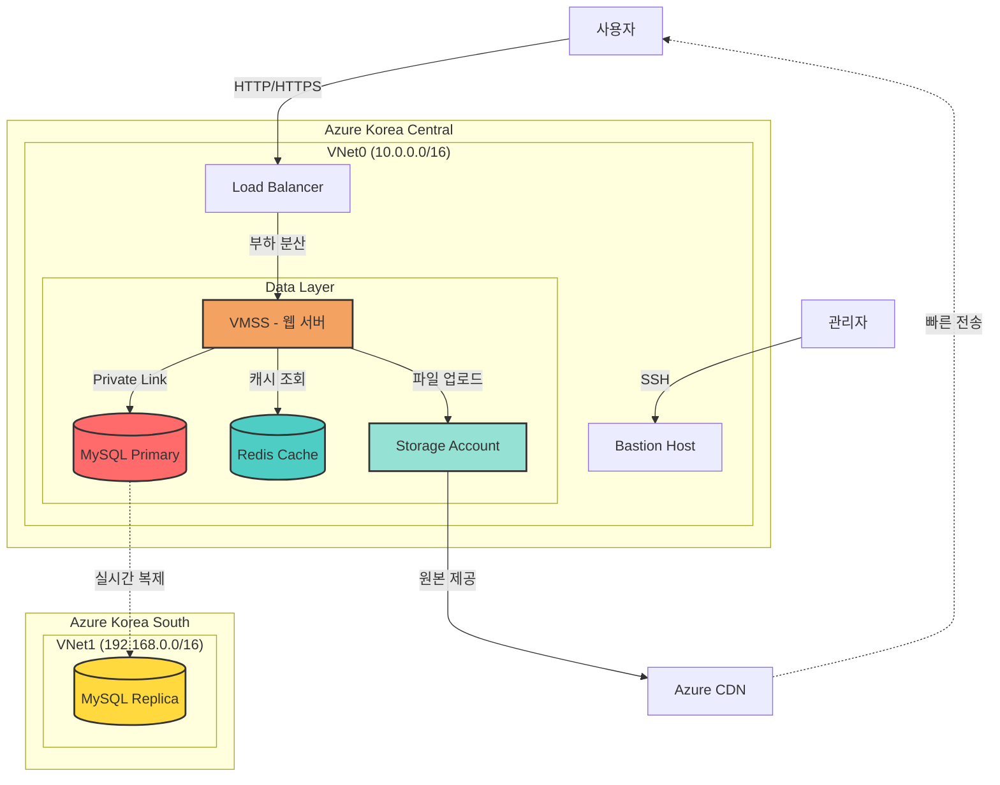

# Azure Infrastructure 통합 아키텍처 문서

> **작성일**: 2025-11-22  
> **버전**: 2.0  
> **프로젝트**: WordPress 기반 웹 서비스 인프라

---

## 📋 목차

1. [프로젝트 개요](#프로젝트-개요)
2. [문서 맵 (Documentation Map)](#문서-맵-documentation-map)
3. [전체 아키텍처](#전체-아키텍처)
4. [모듈별 상세 구조](#모듈별-상세-구조)
5. [현재 구성 현황](#현재-구성-현황)
6. [확장 가능성](#확장-가능성)
7. [보안 및 컴플라이언스](#보안-및-컴플라이언스)

---

## 문서 맵 (Documentation Map)

이 프로젝트는 다음 문서들로 구성되어 있습니다. 목적에 맞는 문서를 참고하세요.

| 문서 | 설명 | 주요 내용 |
|------|------|----------|
| **[README.md](./README.md)** | 프로젝트 메인 가이드 | 개요, 실행 방법, 전체 요약 |
| **[Architecture_Layers.md](./Architecture_Layers.md)** | 아키텍처 상세 | 계층별 구조, 데이터 흐름도, 네트워크 토폴로지 |
| **[Module_Scalability.md](./Module_Scalability.md)** | 확장성 분석 | 모듈별 확장 포인트, 기술적 로드맵, 비용 분석 |
| **[Azure_Evaluation.md](./Azure_Evaluation.md)** | 평가 및 진단 | 현재 인프라 상태 진단, 보안/규정 준수 평가 |

---

## 프로젝트 개요

### 목적
Terraform을 사용하여 Azure 클라우드 환경에 WordPress 기반 웹 서비스 인프라를 자동화하여 구축합니다.

### 팀 구성원 역할
이 프로젝트는 실제 기업 환경을 모방한 5인 팀 구조로 설계되었습니다:

| 역할 | 핵심 책임 | 주요 산출물 |
|------|---------|------------|
| **팀장 / PM** | 전체 일정 관리, 스프린트 조정, 외부 커뮤니케이션, 품질/배포 승인 | 일정표, 컬러스 플랜, 최종 보고서 초안 |
| **네트워크/인프라 엔지니어** | VNet 설계, 서브넷/피어링/NAT/LB, Terraform 네트워크 모듈 작성 | VNet 설계도, 00_vnet.tf 등 네트워크 파일들 |
| **컴퓨트/애플리케이션 엔지니어** | VM/VMSS 프로비저닝, 스크립트 조정, 애플리케이션 배포 자동화 | 애플리케이션 스크립트, WordPress 백엔드 배포 가이드 |
| **데이터/스토리지 엔지니어** | MySQL 설계, 백업/복제 정책, Private Endpoint 설정 | 백업 정책서, MySQL 모듈 파일 |
| **보안/운영 (SecOps) 엔지니어** | NSG/Firewall/Entra ID, Key Vault, Runbook, 모니터링 알림 | 보안 정책서, Azure Policy 문서 |

### 주요 기술 스택
- **IaC**: Terraform
- **Cloud**: Microsoft Azure
- **데이터베이스**: MySQL Flexible Server
- **웹 서버**: Apache/Nginx on Rocky Linux
- **형상 관리**: Git

---

## 전체 아키텍처

### 고수준 아키텍처 다이어그램



### 계층별 구조 요약

> 상세한 계층별 설명과 다이어그램은 **[Architecture_Layers.md](./Architecture_Layers.md)**를 참조하세요.

- **Access Layer**: Bastion Host, Load Balancer
- **Compute Layer**: VMSS (Web Servers), Image Gallery
- **Data Layer**: MySQL Flexible Server, Redis Cache(비활성)
- **Storage Layer**: Storage Account (GRS), CDN(비활성)

---

## 모듈별 상세 구조

### 1. Network 모듈

**위치**: `modules/Network/`

**파일 구조**:
```
Network/
├── 01_vnet.tf          # VNet 및 Subnet 정의
├── 02_lb.tf            # Load Balancer 설정
├── 03_bastion.tf       # Bastion Host 설정
├── 100_var.tf          # 입력 변수
└── 99_out.tf           # 출력 값
```

**주요 리소스**:
- VNet (가상 네트워크)
- Subnet (서브넷)
- Load Balancer (부하 분산기)
- Bastion (점프 호스트)

**네트워크 분리**:
| VNet | Region | Address Space | 역할 |
|------|--------|---------------|------|
| VNet0 | Korea Central | 10.0.0.0/16 | 메인 서비스 존 |
| VNet1 | Korea South | 192.168.0.0/16 | DR/백업 존 |

### 2. Compute 모듈

**위치**: `modules/Compute/`

**파일 구조** (최근 최적화됨):
```
Compute/
├── 01_image.tf         # 이미지 갤러리
├── 02_vm.tf            # 소스 VM
├── 03_vmss.tf          # VM Scale Set
├── 100_var.tf          # 입력 변수
└── 99_out.tf           # 출력 값
```

**워크플로우**:
1. **VM 생성**: WordPress와 필요한 소프트웨어 설치
2. **이미지화**: VM을 이미지로 캡처 (Golden Image)
3. **VMSS 배포**: 이미지 기반으로 여러 인스턴스 생성

### 3. Security 모듈

**위치**: `modules/Security/`

**파일 구조**:
```
Security/
├── 01_nsg.tf           # 메인 NSG (웹 서버용)
├── 02_nsg_rules.tf     # 추가 NSG 규칙 (SSH, HTTP, DB)
├── 100_var.tf          # 입력 변수
└── 99_out.tf           # 출력 값
```

**보안 규칙**:
- **AllowSSH**: 관리자 IP + VNet 내부에서만 SSH 허용
- **AllowHTTP/HTTPS**: 전체 인터넷에서 웹 접근 허용
- **DenyMySQL**: 외부에서 DB 직접 접근 차단

### 4. Database 모듈

**위치**: `modules/database/`

**파일 구조**:
```
database/
├── 01_server.tf        # MySQL Flexible Server
├── 02_db.tf            # 데이터베이스 생성
├── 03_replica.tf       # 복제본 (조건부)
├── 04_config.tf        # MySQL 설정
├── 05_pe.tf            # Private Endpoint
├── 05_redis.tf.disabled # Redis Cache (비활성)
├── 06_adf.tf           # Data Factory
├── 100_var.tf          # 입력 변수
└── 99_out.tf           # 출력 값
```

**주요 설정**:
- **MySQL 버전**: 8.0.21
- **SKU**: B_Standard_B2s (2vCore, 4GB RAM)
- **백업 보관 기간**: 35일
- **지역 복제**: Korea Central → Korea South

### 5. Storage 모듈

**위치**: `modules/storage/`

**파일 구조** (최근 최적화됨):
```
storage/
├── 01_st_acct.tf       # Storage Account
├── 02_container.tf     # Blob Container
├── 03_life_policy.tf   # Lifecycle 정책
├── 04_cdn_prof.tf.disabled # CDN Profile (비활성)
├── 05_cdn_end.tf.disabled  # CDN Endpoint (비활성)
├── 100_var.tf          # 입력 변수
└── 99_out.tf           # 출력 값
```

**컨테이너 구성**:
| 컨테이너 | 용도 | 접근 수준 |
|----------|------|----------|
| media | 업로드 파일 (이미지, 동영상) | Private |
| tfstate | Terraform State | Private |

**Lifecycle 정책**:
```
0일 → 30일 → 90일 → 365일
Hot   Cool   Archive   삭제
```

---

## 현재 구성 현황

### ✅ 구현 완료
- [x] **Network**: VNet, Subnet, Public IP, NIC
- [x] **Compute**: VM, Image Gallery, VMSS (Rocky Linux 9)
- [x] **Storage**: Storage Account (**GRS 복제**), Container
- [x] **Database**: MySQL Flexible Server, Private Endpoint
- [x] **Connectivity**: VNet Peering (Central ↔ South)
- [x] **Security**: NSG 규칙 (SSH, HTTP, DB 차단)
- [x] **Redis Cache**: `05_redis.tf`
- [x] **Azure CDN**: Front Door Profile
- [x] **MySQL Replica**: 동일 리전(Korea Central) 복제 구성

### ⚠️ 미구현 / 비활성화 (Disabled)
- [ ] **Identity**: Entra ID / RBAC 미구성 (권한 부족: Contributor)

---

## 확장 가능성

자세한 모듈별 확장 가능성은 [`Module_Scalability.md`](./Module_Scalability.md)를 참조하세요.

### 빠른 요약

#### 단기 확장 (1개월)
1. **Redis Cache 활성화** - ✅ **완료** (성능 10배 향상)
2. **CDN 활성화** - ✅ **완료** (Front Door 적용)
3. **Read Replica 추가** - ✅ **완료** (동일 리전 구성)
4. **Auto-Scaling 설정** - CPU 기반 자동 확장

#### 중기 확장 (3개월)
1. **Application Gateway** - WAF 보안 ($150/월)
2. **Key Vault 통합** - 민감 정보 중앙 관리
3. **Read Replica 확장** - 타 리전(Cross-Region) 도입

#### 장기 확장 (6개월)
1. **Container 전환 (AKS)** - Kubernetes 환경
2. **Azure Firewall** - 고급 보안 ($500/월)
3. **Cosmos DB 하이브리드** - NoSQL 데이터 처리

---

## 보안 및 컴플라이언스

### Private Endpoint 구조
```
외부 인터넷 → ❌ 차단
       ↓
  [ 방화벽 ]
       ↓ ✅ 허용
  VNet (사설망)
       ↓
Private Endpoint
       ↓
DB / Storage
```

### NSG 규칙
- 🛡️ SSH: 특정 IP만 허용
- 🌐 HTTP/HTTPS: 전체 허용
- 🔒 MySQL: Private Endpoint만 허용

### 데이터 보호
- ✅ Storage: GRS 복제 (지역 이중화)
- ✅ MySQL: 자동 백업 (35일 보관)
- ✅ 암호화: HTTPS, SSL/TLS 강제

---

## 운영 가이드

### Terraform 명령어
```bash
# 검증
terraform validate

# 계획 확인
terraform plan

# 배포
terraform apply

# 파괴 (주의!)
terraform destroy
```

### 모니터링 포인트
- CPU/메모리: 80% 초과 시 알림
- 디스크: 90% 초과 시 자동 확장
- 연결 수: 커넥션 풀 과다 사용 감지

---

## 참고 문서

### 내부 문서
- [모듈별 확장성 분석](./Module_Scalability.md)
- [Azure 평가 보고서](./Azure_Evaluation.md)
- [계층별 아키텍처](./Architecture_Layers.md)

### 외부 참고
- [Terraform Azure Provider](https://registry.terraform.io/providers/hashicorp/azurerm/latest/docs)
- [Azure 아키텍처 센터](https://learn.microsoft.com/azure/architecture/)
- [MySQL Flexible Server](https://learn.microsoft.com/azure/mysql/flexible-server/)

---

**마지막 업데이트**: 2025-11-22  
**담당자**: wwwuser 팀
