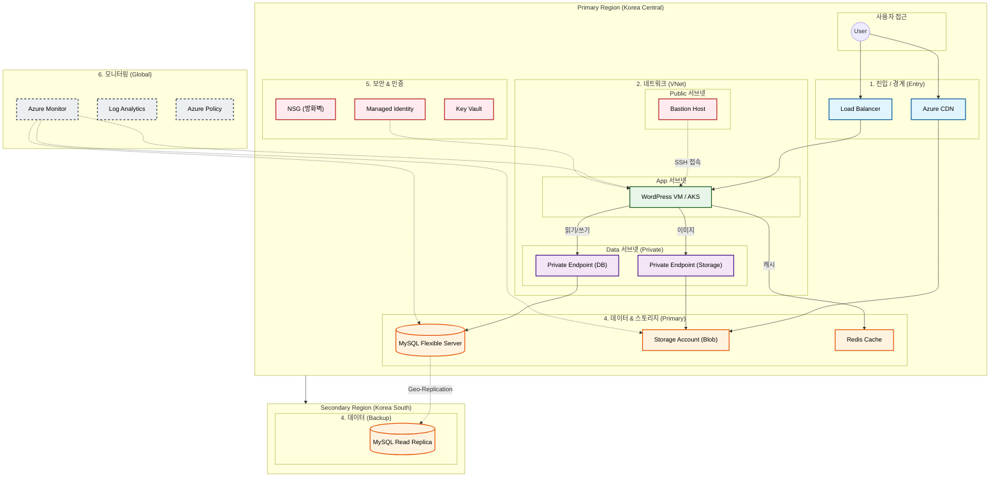

# 🏗️ 시스템 아키텍처 (System Architecture)

이 문서는 전체 시스템의 구조를 **6가지 핵심 레이어**로 구분하여 시각화한 자료입니다.
팀원들이 전체적인 데이터 흐름과 보안 계층을 한눈에 파악할 수 있도록 작성되었습니다.

## 1. 한눈에 보는 구조 (텍스트 버전)

Mermaid 렌더링이 어려운 환경을 위해 텍스트로 표현한 구조도입니다.

```text
   [ Primary Region (Korea Central) ]                 [ Secondary Region (Korea South) ]
   
          [ 사용자 (User) ]
                 |
   +-------------+-------------+
   |      1. 진입 (Entry)      |
   | [CDN]              [LB]   |
   +------+------------+-------+
          |            |
+---------+------------+---------------------+
|    2. 네트워크 (Network Layer / VNet)      |
|                                            |
|  +-------------+    +-------------------+  |
|  | Public Subnet    |    App Subnet     |  |
|  | [Bastion] --+--->| [WordPress VM]    |  |
|  +-------------+    +---------+---------+  |
|                               |            |
|          +--------------------+            |
|          |                                 |
|  +-------v-----------------------+         |
|  |      Data Subnet (Private)    |         |
|  | [Private Endpoint (DB)]       |         |
|  |             |                 |         |
|  +-------------+-----------------+         |
|                |                           |
+----------------+---------------------------+
                 |
    +------------v------------+                       +-------------------------+
    |      4. 데이터 (Data)   |   Geo-Replication     |    4. 데이터 (Backup)   |
    | [MySQL Primary] --------+---------------------->| [MySQL Read Replica]    |
    |                         |                       |                         |
    +-------------------------+                       +-------------------------+
    
    * 스토리지: [Storage Account] (Global)
    * 캐시: [Redis Cache] (Primary Region)
    * 보안: NSG & Managed Identity 적용
    * 모니터링: Azure Monitor (Global)
```

---

## 2. 상세 다이어그램 (Mermaid)



## 3. 레이어별 상세 설명

### 1) 🚪 진입 / 경계 (Entry Layer)
*   **Azure CDN**: 이미지나 CSS 같은 정적 파일을 전 세계에 빠르게 배포합니다.
*   **Load Balancer**: 사용자가 몰릴 때 트래픽을 여러 서버로 나눠줍니다.

### 2) 🌐 네트워크 (Network Layer)
*   **VNet (가상 네트워크)**: 클라우드 안에 우리만의 사설망을 만듭니다. (Primary Region)
*   **서브넷 분리**:
    *   `Public`: 외부에서 접근 가능한 곳 (Bastion)
    *   `App`: 웹 사이트가 돌아가는 곳
    *   `Data`: DB와 스토리지가 숨어있는 곳 (외부 접근 금지)
*   **Private Endpoint**: DB에 사설 IP를 줘서 해커가 못 들어오게 막습니다.

### 3) 💻 컴퓨트 (Compute Layer)
*   **WordPress VM / AKS**: 실제 웹 사이트 프로그램이 돌아가는 서버입니다.
*   **Auto Scaling**: 사람이 많이 오면 서버가 자동으로 늘어납니다.

### 4) 💾 데이터 (Data Layer)
*   **MySQL Flexible Server**: 회원 정보, 글 내용을 저장하는 메인 DB입니다. (Korea Central)
*   **MySQL Read Replica**: 만약의 사태(재해)를 대비해 다른 지역(Korea South)에 데이터를 실시간으로 복제해 둡니다.
*   **Storage Account**: 이미지, 동영상 파일을 저장하는 창고입니다.
*   **Redis Cache**: 자주 찾는 데이터를 메모리에 올려서 속도를 엄청 빠르게 해줍니다.

### 5) 🛡️ 보안 (Security Layer)
*   **NSG (네트워크 보안 그룹)**: 허락된 IP와 포트만 통과시키는 문지기입니다.
*   **Managed Identity**: 서버가 아이디/비번 없이 안전하게 권한을 얻는 방식입니다.

### 6) 📊 모니터링 (Monitoring Layer)
*   **Azure Monitor**: 서버가 아픈지 안 아픈지 24시간 감시합니다.
*   **Log Analytics**: 로그를 모아서 문제 원인을 분석합니다.

## 4. 기술 참조 (Technical References)

이 아키텍처에 사용된 주요 Azure 리소스의 Terraform 문서입니다.

*   **Database**
    *   [MySQL Flexible Server](https://registry.terraform.io/providers/hashicorp/azurerm/latest/docs/resources/mysql_flexible_server)
    *   [MySQL Flexible Database](https://registry.terraform.io/providers/hashicorp/azurerm/latest/docs/resources/mysql_flexible_database)
*   **Storage & Cache**
    *   [Storage Account](https://registry.terraform.io/providers/hashicorp/azurerm/latest/docs/resources/storage_account)
    *   [Redis Cache](https://registry.terraform.io/providers/hashicorp/azurerm/latest/docs/resources/redis_cache)
*   **Network & Security**
    *   [Private Endpoint](https://registry.terraform.io/providers/hashicorp/azurerm/latest/docs/resources/private_endpoint)
    *   [CDN Profile](https://registry.terraform.io/providers/hashicorp/azurerm/latest/docs/resources/cdn_profile)
    *   [CDN Endpoint](https://registry.terraform.io/providers/hashicorp/azurerm/latest/docs/resources/cdn_endpoint)
*   **Analytics**
    *   [Data Factory](https://registry.terraform.io/providers/hashicorp/azurerm/latest/docs/resources/data_factory)
