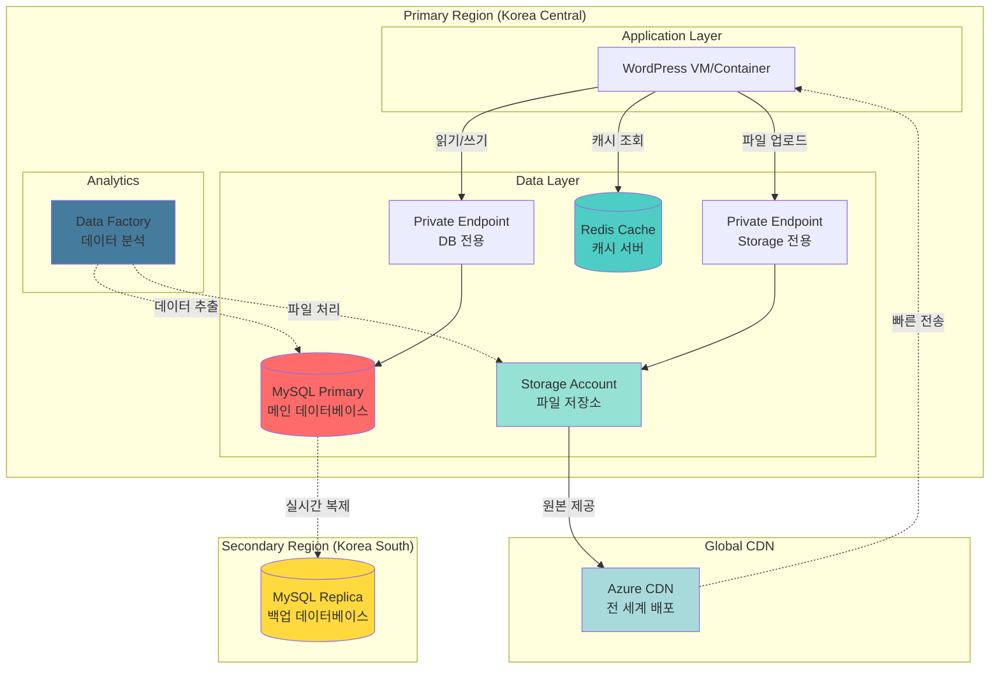

# 🗄️ DB & Storage 아키텍처

## 📋 개요

이 문서는 WordPress 워드프레스 서비스의 **데이터베이스**와 **스토리지** 인프라 구조를 설명합니다.

---

## 🏗️ 전체 구조도



---

## 💾 데이터베이스 구조

### MySQL Flexible Server

**역할**: WordPress의 모든 데이터 저장 (글, 사용자, 댓글 등)

**구성**:
```
┌─────────────────────────────────────┐
│  Primary (Korea Central)            │
│  - MySQL 8.0.21                     │
│  - B_Standard_B2s (2vCore, 4GB)     │
│  - 읽기/쓰기 처리                   │
│  - Private Endpoint 연결            │
└─────────────────────────────────────┘
         ↓ (Geo-Replication)
┌─────────────────────────────────────┐
│  Replica (Korea South)              │
│  - 읽기 전용                        │
│  - 재해 복구용                      │
│  - 자동 동기화                      │
└─────────────────────────────────────┘
```

**주요 특징**:
- ✅ **자동 백업**: 매일 백업, 35일 보관
- ✅ **지역 이중화**: 한국 중부 → 한국 남부 실시간 복제
- ✅ **보안 접속**: Private Endpoint로 외부 차단
- ✅ **감사 로그**: 모든 DB 접근 기록 저장

---

## 💿 캐시 시스템

### Redis Cache

**역할**: 자주 조회하는 데이터를 메모리에 저장해서 DB 부하 감소

**구성**:
```
Redis Cache (Korea Central)
├─ SKU: Basic / Standard / Premium
├─ 용량: 250MB ~ 53GB 선택 가능
├─ 포트: 6380 (SSL 암호화)
└─ 용도: 세션, 페이지 캐싱, 객체 캐싱
```

**캐싱 전략**:
- 🔹 WordPress 페이지 캐시
- 🔹 데이터베이스 쿼리 결과 저장
- 🔹 사용자 세션 정보 저장

---

## 📦 스토리지 구조

### Storage Account

**역할**: 이미지, 동영상, Terraform State 파일 저장

**컨테이너 구성**:

| 컨테이너명 | 용도 | 접근 수준 | 비고 |
|-----------|------|----------|------|
| **media** | 업로드 파일 (이미지, 동영상) | Private | Lifecycle 정책 적용 |
| **tfstate** | Terraform 상태 파일 | Private | 🔒 매우 중요! |

**Lifecycle Management**:
```
업로드된 파일 수명 주기:
0일 ────────> 30일 ────────> 90일 ────────> 365일
 │              │              │              │
저장 (Hot)    Cool Tier    Archive      자동 삭제
              (비용 ↓)     (비용 ↓↓)
```

---

## 🌍 CDN (Content Delivery Network)

**역할**: 전 세계 사용자에게 이미지를 빠르게 전송

**작동 방식**:
```
사용자 (일본) ──┐
사용자 (미국) ──┼──> CDN Edge (가까운 서버)
사용자 (유럽) ──┘         │
                          ↓ (최초 1회만 가져옴)
                   Storage Account (한국)
```

**주요 효과**:
- ⚡ 이미지 로딩 속도 3~10배 향상
- 💰 원본 스토리지 트래픽 비용 절감
- 🌏 전 세계 어디서나 빠른 접속

---

## 📊 데이터 분석

### Data Factory

**역할**: DB 데이터를 추출하여 분석 작업 수행

**사용 시나리오**:
- 📈 일별/월별 통계 데이터 생성
- 🔄 데이터 변환 및 가공
- 📤 외부 시스템으로 데이터 전송

---

## 🔒 보안 구조

### Private Endpoint

모든 데이터 리소스는 **Private Endpoint**를 통해서만 접근 가능:

```
외부 인터넷 (Public)
         ↓ ❌ 차단
    [ 방화벽 ]
         ↓ ✅ 허용
   VNet (사설망)
         ↓
Private Endpoint
         ↓
   DB / Storage
```

**보안 특징**:
- 🛡️ Public IP 없음 (외부 접근 불가)
- 🔐 VNet 내부에서만 접근 가능
- 📝 모든 접근 기록 감사 로그에 저장

---

## 📈 데이터 흐름

### 1️⃣ 사용자가 글 작성 시

```
1. 웹 서버 ──> Redis 캐시 확인
2. 웹 서버 ──> Private Endpoint ──> MySQL (글 저장)
3. MySQL ──────────────────────────> Replica (자동 복제)
4. 웹 서버 ──> Redis (캐시 업데이트)
```

### 2️⃣ 사용자가 이미지 업로드 시

```
1. 웹 서버 ──> Private Endpoint ──> Storage Account (파일 저장)
2. Storage ──────────────────────> CDN (전 세계 배포)
3. 사용자 ──> CDN Edge 서버 (빠른 다운로드)
```

### 3️⃣ 데이터 분석 시

```
1. Data Factory ──> MySQL (데이터 추출)
2. Data Factory ──> 데이터 가공/변환
3. Data Factory ──> Storage (결과 저장)
```

---

## 💡 주요 특징 정리

| 항목 | 구성 | 목적 |
|------|------|------|
| **고가용성** | Primary + Replica DB | 재해 대비 |
| **성능 향상** | Redis Cache | 응답 속도 10배 ↑ |
| **글로벌 배포** | Azure CDN | 전 세계 빠른 접속 |
| **보안 강화** | Private Endpoint | 외부 차단 |
| **비용 절감** | Lifecycle Policy | 자동 정리 |
| **데이터 분석** | Data Factory | ETL 작업 |

---

## 🔧 관리 포인트

### 백업
- **자동 백업**: 매일 실행, 35일 보관
- **지역 복제**: 한국 남부에 실시간 복제
- **복구 시간**: 재해 발생 시 4시간 이내 복구 가능

### 모니터링
- **CPU/메모리**: 80% 초과 시 알림
- **디스크**: 90% 초과 시 자동 확장
- **연결 수**: 커넥션 풀 과다 사용 감지

### 비용 최적화
- **Storage Lifecycle**: 30일 후 Cool Tier 이동
- **Redis**: 필요 시에만 Standard/Premium 사용
- **CDN**: 캐시 Hit Rate 90% 이상 유지

---

## 📚 관련 문서

- [MySQL Terraform](https://registry.terraform.io/providers/hashicorp/azurerm/latest/docs/resources/mysql_flexible_server)
- [Storage Terraform](https://registry.terraform.io/providers/hashicorp/azurerm/latest/docs/resources/storage_account)
- [Redis Terraform](https://registry.terraform.io/providers/hashicorp/azurerm/latest/docs/resources/redis_cache)
- [CDN Terraform](https://registry.terraform.io/providers/hashicorp/azurerm/latest/docs/resources/cdn_profile)
- [Data Factory Terraform](https://registry.terraform.io/providers/hashicorp/azurerm/latest/docs/resources/data_factory)

---

**작성일**: 2025-11-20  
**버전**: 1.0 (DB/Storage 집중 간소화)
