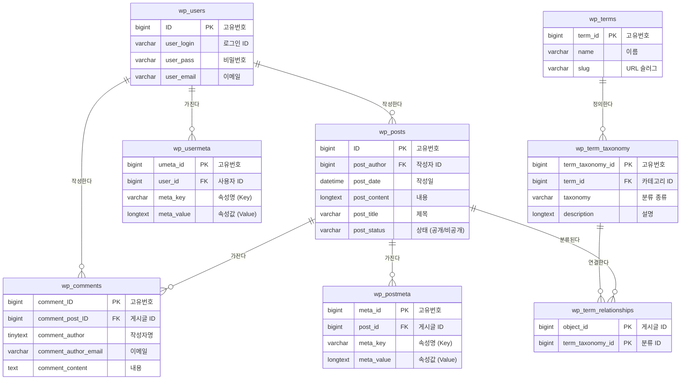

# 📊 데이터베이스 구조도 (ERD)

이 문서는 **워드프레스(WordPress)**의 핵심 데이터 구조를 설명합니다.
누구나 쉽게 이해할 수 있도록 **텍스트 그림(ASCII)**과 **상세 다이어그램(Mermaid)** 두 가지 방식으로 정리했습니다.

## 1. 한눈에 보는 구조 (텍스트 버전)

Mermaid 렌더링이 어려운 환경을 위해 텍스트로 표현한 구조도입니다.

```text
+---------------------+          +---------------------+          +---------------------+
|    사용자 (Users)   |          |    게시글 (Posts)   |          |   댓글 (Comments)   |
|      [wp_users]     |          |      [wp_posts]     |          |    [wp_comments]    |
+---------------------+          +---------------------+          +---------------------+
| ID (PK)             |<----+    | ID (PK)             |<----+    | ID (PK)             |
| 로그인 ID           |     +----| 작성자 (FK)         |     +----| 게시글 ID (FK)      |
| 비밀번호            |          | 제목                |          | 작성자              |
| 이메일              |          | 내용                |          | 댓글 내용           |
+----------+----------+          +----------+----------+          +---------------------+
           |                                |
           | 1명이 여러 개                  | 1글에 여러 개
           v                                v
+---------------------+          +---------------------+
| 사용자 정보 (Meta)  |          | 게시글 정보 (Meta)  |
|    [wp_usermeta]    |          |    [wp_postmeta]    |
+---------------------+          +---------------------+
| 고유번호 (PK)       |          | 고유번호 (PK)       |
| 사용자 ID (FK)      |          | 게시글 ID (FK)      |
| 키 (Key)            |          | 키 (Key)            |
| 값 (Value)          |          | 값 (Value)          |
+---------------------+          +---------------------+

       +---------------------+          +---------------------------+
       |   카테고리 (Terms)  |          |     분류 체계 (Taxonomy)  |
       |      [wp_terms]     |          |     [wp_term_taxonomy]    |
       +---------------------+          +---------------------------+
       | ID (PK)             |<---------| ID (PK)                   |
       | 이름                |          | 카테고리 ID (FK)          |
       | 슬러그 (URL)        |          | 분류 (태그/카테고리)      |
       +---------------------+          +-------------+-------------+
                                                      ^
                                                      | 1개 분류에
                                                      | 여러 글 포함
                                          +-----------+-----------+
                                          |     분류-글 연결      |
                                          | [wp_term_relationships]
                                          +-----------------------+
                                          | 게시글 ID (PK, FK)    | <--- wp_posts.ID
                                          | 분류 ID (PK)          |
                                          +-----------------------+
```

---

## 2. 상세 다이어그램 (Mermaid)



## 3. 주요 테이블 설명

| 테이블명 | 한글명 | 설명 | 비고 |
| :--- | :--- | :--- | :--- |
| **wp_users** | 사용자 | 회원 정보 (아이디, 비번, 이메일) | 🔒 개인정보 암호화 필수 |
| **wp_posts** | 게시글 | 글, 페이지, 메뉴 등 모든 콘텐츠 | 💾 데이터가 가장 많음 |
| **wp_comments** | 댓글 | 게시글에 달린 방문자 댓글 | 🛡️ 스팸 관리 필요 |
| **wp_postmeta** | 게시글 정보 | 썸네일, 조회수 등 추가 정보 | Key-Value 방식 |
| **wp_usermeta** | 사용자 정보 | 권한, 테마 설정 등 추가 정보 | Key-Value 방식 |
| **wp_terms** | 카테고리 | 카테고리나 태그의 이름 | 분류 체계 |
