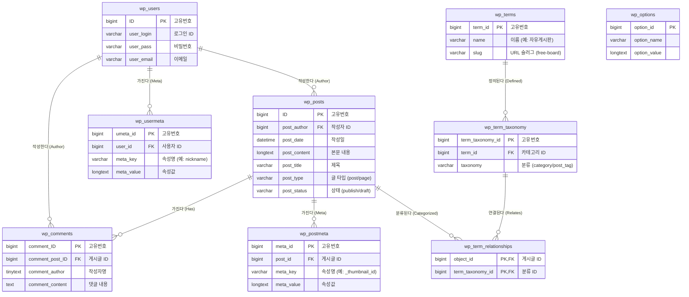

# 📊 데이터베이스 구조도 (ERD)

이 문서는 **팀 프로젝트(WordPress 기반)**의 핵심 데이터 구조를 설명합니다.  
단순한 테이블 나열이 아닌, **데이터가 실제로 어떻게 흐르고 저장되는지**를 중심으로 풀어서 정리했습니다.

---

## 1. 데이터베이스 개요 (Story)

우리의 데이터베이스는 크게 **사용자**, **콘텐츠**, **분류**, **설정**의 4가지 핵심 영역으로 구성됩니다.

### 👤 1) 사용자 (Users)
- 사이트에 가입하는 모든 회원은 `wp_users` 테이블에 저장됩니다.
- 아이디, 비밀번호, 이메일 같은 **기본 정보**는 여기에 담깁니다.
- 그 외의 **부가 정보**(별명, 권한, 관리자 화면 색상 등)는 `wp_usermeta`라는 별도 테이블에 **Key-Value** 형태로 유연하게 저장됩니다.

### 📝 2) 콘텐츠 (Posts)
- 우리가 작성하는 **모든 글**은 `wp_posts` 테이블에 저장됩니다.
- 블로그 포스트뿐만 아니라 **페이지, 메뉴, 첨부파일(이미지)**까지도 모두 이 테이블 하나에서 관리됩니다 (`post_type`으로 구분).
- 글의 **추가 정보**(썸네일 이미지 주소, 조회수, 좋아요 수 등)는 `wp_postmeta` 테이블에 저장됩니다.

### 🏷️ 3) 분류 (Taxonomy)
- 글을 체계적으로 정리하기 위한 **카테고리**와 **태그**는 `wp_terms` 테이블에 이름이 저장됩니다.
- 이 이름이 '카테고리'인지 '태그'인지 정의하는 것은 `wp_term_taxonomy` 테이블입니다.
- 마지막으로, "어떤 글이 어떤 카테고리에 속하는지" 연결해주는 역할은 `wp_term_relationships` 테이블이 담당합니다.

### ⚙️ 4) 설정 (Options)
- 사이트 제목, URL, 관리자 이메일, 플러그인 설정 등 **사이트 전역 설정**은 `wp_options` 테이블에 저장됩니다.
- 이 테이블은 다른 테이블과 관계를 맺지 않고 독립적으로 존재하며, 사이트 구동의 핵심 정보를 담고 있습니다.

---

## 2. 시각적 구조도 (ERD)

### 🎨 상세 다이어그램 (Mermaid)

---

## 3. 테이블 상세 명세서

팀 프로젝트 보고서용으로 주요 테이블의 역할과 예시 데이터를 정리했습니다.

| 테이블명 | 한글명 | 핵심 역할 | 실제 데이터 예시 |
| :--- | :--- | :--- | :--- |
| **wp_users** | 사용자 | 회원가입 시 생성되는 계정 정보 | `admin`, `user1`, `test@example.com` |
| **wp_posts** | 게시글 | 블로그 글, 페이지, 업로드한 이미지 파일 | `안녕하세요!`, `회사소개 페이지`, `logo.png` |
| **wp_comments** | 댓글 | 게시글에 달린 방문자의 댓글 | `좋은 글 잘 보고 갑니다!`, `질문 있어요.` |
| **wp_options** | 설정 | 사이트 전역 설정 및 플러그인 옵션 | `siteurl` (http://...), `blogname` (내 블로그) |
| **wp_postmeta** | 글 속성 | 글에 대한 추가 정보 (확장성) | `_thumbnail_id` (대표 이미지 번호), `views` (조회수) |
| **wp_usermeta** | 유저 속성 | 사용자에 대한 추가 정보 (확장성) | `wp_capabilities` (관리자/구독자 권한), `first_name` |
| **wp_terms** | 용어 | 카테고리나 태그의 실제 이름 | `IT뉴스`, `일상`, `맛집` |
| **wp_term_relationships** | 관계 | 어떤 글이 어떤 카테고리에 속하는지 연결 | 글 ID `10`번은 카테고리 ID `5`번(`IT뉴스`)에 속함 |

---

## 4. 데이터베이스 설계의 특징 (보고서용)

1.  **유연한 확장성 (Meta Tables)**
    - `wp_users`나 `wp_posts` 테이블의 구조를 변경하지 않고도, `_meta` 테이블을 통해 무한히 새로운 속성을 추가할 수 있습니다.
    - 예: 회원 테이블에 '전화번호' 컬럼이 없어도, `wp_usermeta`에 `phone`이라는 키로 저장하면 됩니다.

2.  **통합된 콘텐츠 관리**
    - 공지사항, 블로그, 페이지, 포트폴리오 등 성격이 다른 콘텐츠를 `wp_posts` 하나의 테이블에서 `post_type` 컬럼만 다르게 하여 통합 관리합니다.
    - 이는 검색 및 관리를 매우 효율적으로 만듭니다.

3.  **표준화된 분류 체계**
    - 카테고리(계층형)와 태그(비계층형)를 `Taxonomy`라는 하나의 개념으로 추상화하여 관리합니다.
