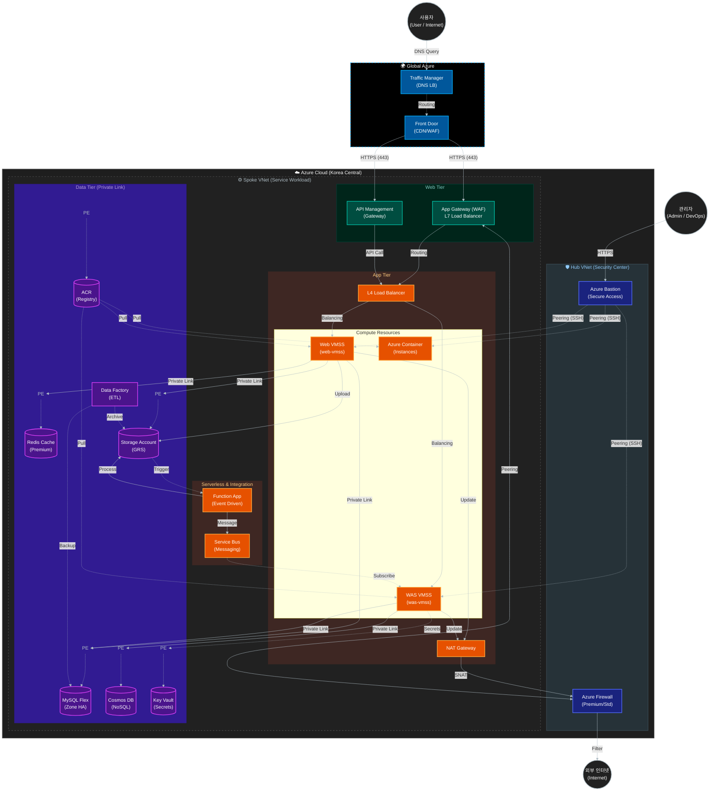

# 프로젝트 개요 (Project Overview)

## 1. 프로젝트 주제
**"제로 트러스트 기반 보안 클라우드 애플리케이션 플랫폼 및 지능형 위협 대응 시스템 구축"**
(Zero Trust-based Secure Cloud Application Platform & Intelligent Threat Response System)

이 프로젝트는 기존의 하이브리드 클라우드 인프라 위에 **데이터 및 애플리케이션 중심의 보안(Data & App Security)**을 강화하고, **지능형 위협 탐지 및 자동화된 대응(SecOps)** 체계를 구축하여 안전하고 탄력적인 클라우드 서비스를 완성하는 것을 목표로 합니다.

---

## 2. 프로젝트 구성

본 프로젝트는 크게 3가지 단계로 구성되어 있으며, 각 단계는 클라우드 인프라의 안정성, 내부 보안, 외부 보안을 검증하고 강화하는 것을 목표로 합니다.

### 가. 아키텍처 검증 (Architecture Verification)
구축된 하이브리드 클라우드 인프라가 설계대로 동작하는지 확인하고, 고가용성(HA) 및 성능을 검증합니다.
*   **주요 활동**: VMSS 오토스케일링 테스트, DB Failover 테스트, 부하 분산 확인.
*   **목표**: 서비스 중단 없는 안정적인 인프라 운영 보장.

### 나. 내부 보안 (Internal Security - Project 3)
클라우드 내부 자산(데이터, 애플리케이션)을 보호하고, 제로 트러스트 원칙을 적용합니다.
*   **ID 및 액세스 관리**: RBAC 권한 분리, Azure Policy 적용.
*   **데이터 보호**: DB/Storage 암호화, Private Endpoint 적용, Key Vault 연동.
*   **애플리케이션 보안**: 웹 취약점(SQL Injection, XSS) 방어 및 시나리오 검증.

### 다. 외부 보안 (External Security - Project 4)
외부 위협으로부터 시스템을 방어하고, 지능형 위협 탐지 및 대응 체계를 구축합니다.
*   **위협 탐지 (SIEM)**: Microsoft Sentinel을 활용한 로그 분석 및 위협 식별.
*   **자동화된 대응 (SOAR)**: 위협 탐지 시 자동 차단 및 알림(Playbook) 구현.
*   **클라우드 워크로드 보호**: Defender for Cloud를 통한 취약점 진단 및 보호.

---

## 3. 역할별 아키텍처 및 핵심 포인트

팀원의 역할에 따라 집중해서 봐야 할 아키텍처 뷰(View)와 핵심 구성 요소를 정리했습니다.

### 👷 **1) 아키텍처 및 인프라 검증 담당 (Architecture View)**
**"서비스가 중단 없이 잘 돌아가는가?"**

*   **네트워크 구조 (Hub-Spoke):**
    *   **Hub VNet:** 보안의 중앙 거점. Azure Firewall과 Bastion이 위치합니다.
    *   **Spoke VNet:** 실제 서비스가 구동되며 Web/App/Data 계층으로 서브넷이 분리됩니다.
*   **트래픽 흐름 (Inbound/Outbound):**
    *   **Inbound:** User → Traffic Manager → Front Door → App Gateway (WAF) → VMSS.
    *   **Outbound:** VMSS → NAT Gateway → Azure Firewall → Internet. (단일 IP 통신 보장)
*   **고가용성 (HA):**
    *   **MySQL Flexible Server:** Zone Redundant (가용 영역 이중화) 구성.
    *   **VMSS:** 부하에 따른 오토스케일링(Auto-scaling) 설정.
    *   **Traffic Manager:** 리전 장애 시 트래픽 우회 가능.

*   **주요 확인 대상:**
    *   **VMSS Auto-scaling:** 부하 발생 시 인스턴스가 늘어나는가?
    *   **Private Link:** Private Endpoint를 통해 내부 통신이 정상적으로 되는가?
    *   **Nat Gateway:** 내부 서버가 외부 업데이트를 받을 때 단일 IP로 나가는가?

### 🔒 **2) 내부 보안 담당 (Internal Security View)**
**"내부 데이터와 접근 권한이 안전한가?"**

*   **데이터 격리 (Isolation):**
    *   **Private Endpoint:** DB, Redis, Storage, Key Vault는 **Public IP가 전혀 없습니다.** 오직 내부 VNet의 Private IP로만 통신합니다.
    *   **VNet Peering:** Hub와 Spoke 간 피어링을 통해 관리 트래픽만 허용합니다.
*   **ID 및 권한 관리 (Identity):**
    *   **Entra ID (RBAC):** 사용자에 따라 최소 권한 원칙(Least Privilege)을 적용합니다.
    *   **Managed Identity:** VM이 Access Key(하드코딩된 비밀번호) 없이 Key Vault나 Storage에 접근하도록 구성합니다.
*   **보안 정책:**
    *   **Azure Policy:** 허용되지 않은 리전(Korea Central 외) 리소스 생성 차단, HTTPS 강제.

*   **주요 확인 대상:**
    *   **Key Vault:** DB 비밀번호 등 민감 정보가 안전하게 저장되고 호출되는가?
    *   **NSG (Network Security Group):** 서브넷 간 불필요한 포트가 차단되어 있는가? (Micro-segmentation)
    *   **Azure Policy:** 리소스 생성 위치 제한, 태그 강제 등 정책이 적용되는가?
    *   **MySQL Security:** TDE 암호화, 데이터 마스킹이 적용되어 있는가?

### 🛡️ **3) 외부 보안 및 관제 담당 (External Security & SecOps View)**
**"공격을 탐지하고 대응할 수 있는가?"**

*   **심층 방어 (Defense in Depth):**
    *   **Edge:** Front Door (CDN 레벨 DDoS 방어).
    *   **Perimeter:** Azure Firewall (L3/L4/L7 필터링, 위협 인텔리전스 차단).
    *   **Application:** App Gateway WAF (OWASP 3.2 규칙 - SQLi, XSS 차단).
    *   **Host:** NSG (서브넷/NIC 레벨 포트 차단), Defender for Cloud.
*   **보안 관제 (SecOps):**
    *   **Log Analytics:** 모든 리소스(Firewall, VM, DB)의 로그를 중앙 수집.
    *   **Microsoft Sentinel:** 수집된 로그를 KQL로 분석하여 공격 징후 탐지 및 SOAR(Logic App)를 통한 자동 차단 수행.

*   **주요 확인 대상:**
    *   **WAF (Web Application Firewall):** SQL Injection, XSS 공격을 차단하는가?
    *   **Microsoft Sentinel:** SSH Brute Force 등 위협을 탐지하고 알림(Alert)을 보내는가?
    *   **Log Analytics:** 방화벽 로그, 애플리케이션 로그가 정상적으로 수집되는가?

---

## 4. 전체 아키텍처 개요

본 프로젝트는 **Hub-Spoke 네트워크 토폴로지**를 기반으로 설계되었습니다. 보안과 관리 효율성을 위해 중앙 관리 네트워크(Hub)와 서비스 네트워크(Spoke)를 분리하였으며, **Multi-CIDR** 설계를 통해 각 계층(Management, App, Data)을 논리적/물리적으로 격리하였습니다.

### 핵심 설계 원칙
- **보안 격리 (Isolation)**: Public 접근이 필요한 리소스와 내부 전용 리소스를 철저히 분리.
- **고가용성 (High Availability)**: Zone Redundant 데이터베이스 및 VMSS 자동 확장을 통한 안정성 확보.
- **심층 방어 (Defense in Depth)**: WAF, Azure Firewall, NSG, Private Endpoint를 통한 다계층 보안 적용.

### 아키텍처 다이어그램

