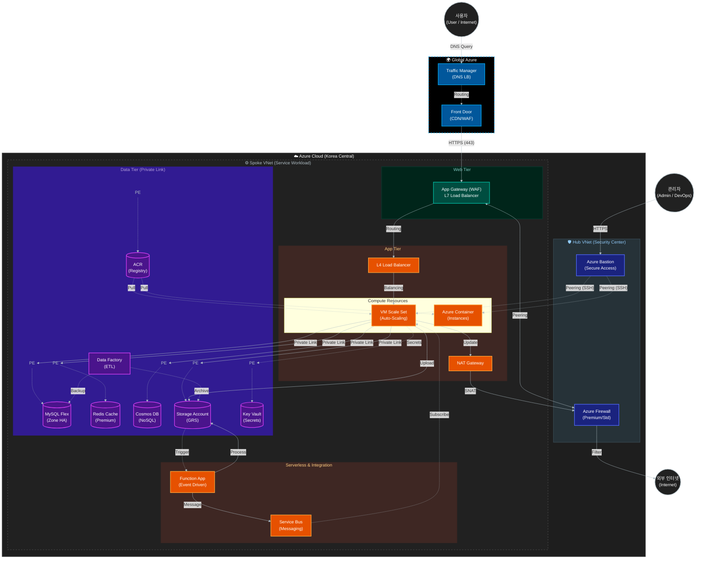

# 아키텍처 총정리 (Architecture Summary)

본 문서는 현재 구축된 Azure 인프라의 전체 아키텍처, 네트워크 구조, 계층별 구성 요소 및 보안 설계를 종합적으로 설명합니다.

## 1. 전체 아키텍처 개요

본 프로젝트는 **Hub-Spoke 네트워크 토폴로지**를 기반으로 설계되었습니다. 보안과 관리 효율성을 위해 중앙 관리 네트워크(Hub)와 서비스 네트워크(Spoke)를 분리하였으며, **Multi-CIDR** 설계를 통해 각 계층(Management, App, Data)을 논리적/물리적으로 격리하였습니다.

### 핵심 설계 원칙
- **보안 격리 (Isolation)**: Public 접근이 필요한 리소스와 내부 전용 리소스를 철저히 분리.
- **고가용성 (High Availability)**: Zone Redundant 데이터베이스 및 VMSS 자동 확장을 통한 안정성 확보.
- **심층 방어 (Defense in Depth)**: WAF, Azure Firewall, NSG, Private Endpoint를 통한 다계층 보안 적용.

### 1.2 아키텍처 다이어그램

---

## 2. 네트워크 구조 (Hub-Spoke)

### 2.1 Hub VNet (Korea Central)
- **역할**: 보안 및 관리의 중앙 거점. 모든 인바운드/아웃바운드 트래픽의 관문 역할을 수행할 수 있습니다.
- **주요 리소스**:
  - **Azure Firewall**: 네트워크 트래픽 제어 및 위협 차단.
  - **Bastion Host**: 관리자가 내부 서버에 안전하게 접속하기 위한 SSH/RDP 진입점 (Public IP 노출 최소화).

### 2.2 Spoke VNet (Korea Central)
- **역할**: 실제 애플리케이션 및 데이터 서비스가 구동되는 공간.
- **VNet Peering**: Hub VNet과 피어링되어 있어, Hub의 보안 자원을 공유하면서도 독립적인 네트워크 환경을 유지합니다.
- **서브넷 구성 (Multi-CIDR)**:
  - **Management (10.0.0.0/16)**: NAT Gateway 등 관리용 리소스.
  - **Data (172.16.0.0/16)**: DB, Storage 등 데이터 리소스 (Private Endpoint 전용).
  - **Application (192.168.0.0/16)**: Web VM, VMSS, Load Balancer 등 애플리케이션 리소스.

---

## 3. 계층별 상세 구성

### 3.1 Management Layer (관리 계층)
- **NAT Gateway**: VMSS 인스턴스들이 외부 패키지 업데이트 등을 위해 인터넷으로 나갈 때 사용하는 아웃바운드 전용 게이트웨이. 고정 IP를 제공하여 보안 화이트리스트 관리에 용이합니다.
- **Bastion Host**: 외부에서 내부의 Private IP를 가진 VM에 안전하게 접속할 수 있도록 지원합니다.

### 3.2 Application Layer (애플리케이션 계층)
- **Application Gateway (WAF)**: L7 로드밸런서로, 웹 해킹(SQL Injection, XSS 등)을 차단하는 웹 방화벽(WAF) 역할을 수행하며 HTTPS 트래픽을 처리합니다.
- **Load Balancer (L4)**: 트래픽을 VMSS 인스턴스들로 부하 분산합니다.
- **VM Scale Set (VMSS)**: 트래픽 부하에 따라 자동으로 서버 수(인스턴스)를 늘리거나 줄이는(Auto-scaling) 웹 서버 그룹입니다.
- **Web VM**: 테스트 및 관리 목적으로 사용되는 단일 웹 서버 인스턴스입니다.

### 3.3 Data Layer (데이터 계층)
- **MySQL Flexible Server**:
  - **Zone Redundant HA**: 가용 영역(Zone) 간 이중화를 통해 장애 발생 시 자동 복구(Failover)를 지원합니다.
  - **Read Replica**: 읽기 부하를 분산하기 위해 복제본을 운영합니다.
- **Redis Cache**: 데이터베이스 부하를 줄이고 응답 속도를 높이기 위한 인메모리 캐시 솔루션입니다.
- **Storage Account**: 이미지, 백업 파일 등을 저장하는 대용량 저장소입니다.

---

## 4. 보안 및 고가용성 설계

### 4.1 보안 (Security)
- **Private Endpoint**: MySQL, Redis, Storage, Key Vault 등 모든 PaaS 서비스는 Public IP 없이 **Private Endpoint**를 통해 VNet 내부 IP로만 통신합니다. 이를 통해 데이터가 인터넷에 노출되는 것을 원천 차단합니다.
- **NSG (Network Security Group)**: 각 서브넷 및 NIC 레벨에서 포트와 프로토콜 기반의 트래픽 필터링을 수행합니다.
- **Azure Key Vault**: 데이터베이스 암호, SSH 키 등 민감한 정보를 안전하게 저장하고 관리합니다.

### 4.2 고가용성 (High Availability)
- **Traffic Manager**: DNS 기반의 글로벌 트래픽 로드밸런싱을 통해 사용자에게 최적의 응답 속도를 제공합니다.
- **Auto-scaling**: CPU 사용량 등 부하에 따라 VMSS 인스턴스가 자동으로 증감하여 트래픽 폭주에 유연하게 대응합니다.
