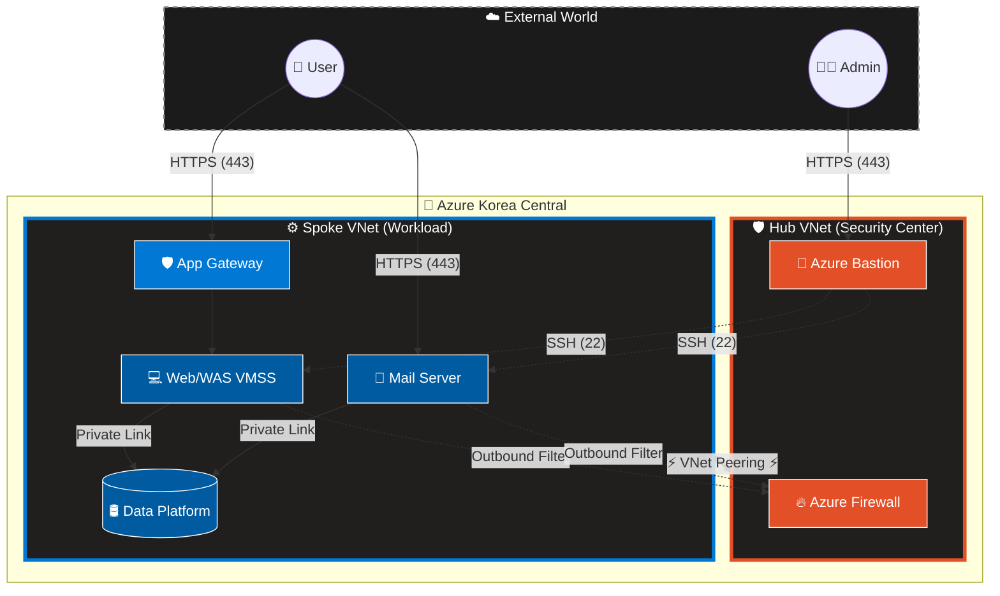
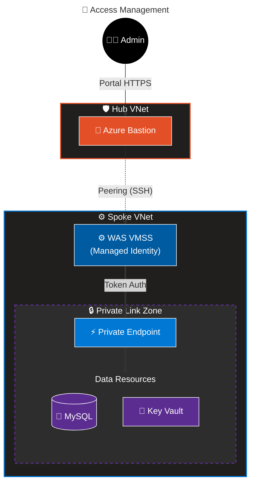
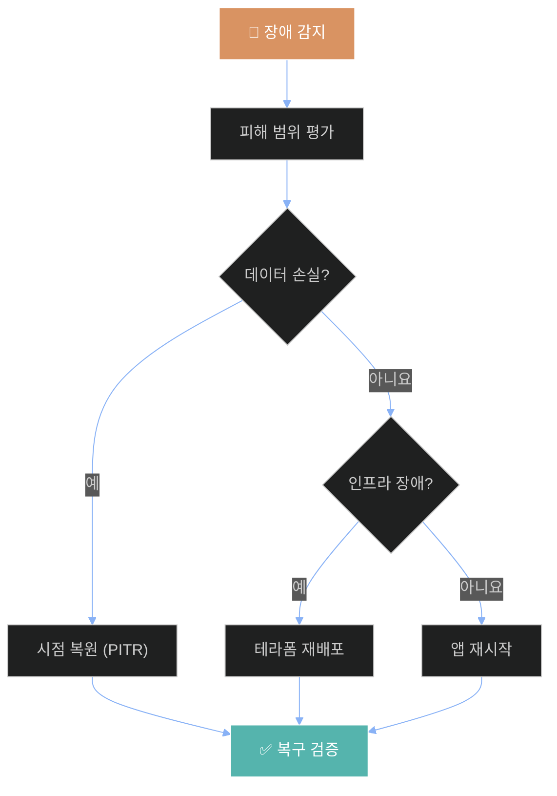

# Terraform 기반 Azure 보안 아키텍처 구축 결과 보고서
**(Azure Security Architecture Implementation Report)**

## 목차

1.  [서론](#1-서론)
    *   [1.1 프로젝트 배경 및 필요성](#11-프로젝트-배경-및-필요성)
    *   [1.2 프로젝트 목표 및 범위](#12-프로젝트-목표-및-범위)
    *   [1.3 해결하고자 하는 주요 보안 과제](#13-해결하고자-하는-주요-보안-과제)
2.  [아키텍처 설계 철학 및 원칙](#2-아키텍처-설계-철학-및-원칙)
    *   [2.1 Zero Trust Security Model](#21-zero-trust-security-model)
    *   [2.2 Immutable Infrastructure (Pets vs Cattle)](#22-immutable-infrastructure-pets-vs-cattle)
    *   [2.3 Hub-Spoke Network Topology](#23-hub-spoke-network-topology)
3.  [인프라 아키텍처 상세 구현](#3-인프라-아키텍처-상세-구현)
    *   [3.1 전체 아키텍처 조감도](#31-전체-아키텍처-조감도)
    *   [3.2 네트워크 인프라 (Hub & Spoke)](#32-네트워크-인프라-hub--spoke)
    *   [3.3 컴퓨팅 리소스 (VMSS & HA)](#33-컴퓨팅-리소스-vmss--ha)
    *   [3.4 데이터 플랫폼](#34-데이터-플랫폼)
    *   [3.5 로드 밸런싱 및 가속화](#35-로드-밸런싱-및-가속화)
4.  [보안 엔지니어링 심층 분석](#4-보안-엔지니어링-심층-분석)
    *   [4.1 Identity & Access Management (IAM)](#41-identity--access-management-iam)
    *   [4.2 Defense-in-Depth (심층 방어 전략)](#42-defense-in-depth-심층-방어-전략)
    *   [4.3 Data Protection (암호화 및 키 관리)](#43-data-protection-암호화-및-키-관리)
    *   [4.4 Threat Detection & Response (SIEM/SOAR)](#44-threat-detection--response-siemsoar)
5.  [보안 관제 및 운영 상세](#5-보안-관제-및-운영-상세)
    *   [5.1 Microsoft Sentinel 탐지 규칙](#51-microsoft-sentinel-탐지-규칙)
    *   [5.2 자동화된 사고 대응 (SOAR Automation)](#52-자동화된-사고-대응-soar-automation)
    *   [5.3 모니터링 및 로깅 아키텍처](#53-모니터링-및-로깅-아키텍처)
6.  [거버넌스 및 재해 복구](#6-거버넌스-및-재해-복구)
    *   [6.1 RBAC 기반 권한 관리 매트릭스](#61-rbac-기반-권한-관리-매트릭스)
    *   [6.2 재해 복구(DR) 및 비즈니스 연속성 계획(BCP)](#62-재해-복구dr-및-비즈니스-연속성-계획bcp)
    *   [6.3 Azure Policy 및 규정 준수](#63-azure-policy-및-규정-준수)
7.  [결론 및 향후 로드맵](#7-결론-및-향후-로드맵)
8.  [부록 A: 주요 Terraform 코드](#8-부록-a-주요-terraform-코드)
9.  [부록 B: Sentinel KQL 라이브러리](#9-부록-b-sentinel-kql-라이브러리)

---

## 1. 서론

### 1.1 프로젝트 배경 및 필요성

디지털 전환이 가속화됨에 따라 기업의 IT 환경은 전통적인 온프레미스 데이터센터에서 유연하고 확장 가능한 클라우드 환경으로 급격히 이동하고 있습니다. 그러나 이러한 클라우드로의 전환은 기존의 경계 중심 보안 모델을 무력화시키며 새로운 보안 위협을 야기하고 있습니다.

특히 가트너(Gartner)와 같은 주요 IT 리서치 기관에서는 '클라우드 보안 사고의 99%는 고객의 과실, 특히 구성 오류에서 기인한다'고 경고하고 있습니다. 개발자의 실수로 인한 스토리지의 퍼블릭 노출, 불필요하게 개방된 RDP/SSH 포트, 그리고 과도한 권한 부여는 데이터 유출의 주된 원인이 됩니다.

이에 본 프로젝트 **Terraform 기반 Azure 보안 아키텍처 구축**은 이러한 인적 오류를 근본적으로 차단하고, 시스템 설계 단계에서부터 보안을 내재화하는 **Security-by-Design** 원칙을 실현하기 위해 시작되었습니다. 우리는 **IaC (Infrastructure as Code)** 도구인 Terraform을 사용하여 인프라의 배포부터 운영까지 전 과정을 코드로 정의하고 자동화함으로써, 일관되고 검증 가능한 보안 수준을 유지하고자 합니다.

### 1.2 프로젝트 목표 및 범위

본 프로젝트의 궁극적인 목표는 **제로 트러스트(Zero Trust) 기반의 안전하고 탄력적인 클라우드 애플리케이션 플랫폼**을 구축하는 것입니다. 이를 달성하기 위한 세부 목표는 다음과 같습니다.

1.  **완전한 자동화:** 네트워크, 컴퓨팅, 보안 설정 등 140개 이상의 모든 Azure 리소스에 대한 배포 과정을 Terraform으로 100% 자동화합니다.
2.  **제로 트러스트 구현:** '아무도 신뢰하지 않는다'는 가정하에, 모든 접근 요청을 명시적으로 검증하고, 최소 권한을 부여하며, 데이터 위치를 격리합니다.
3.  **지능형 위협 대응:** Microsoft Sentinel을 도입하여 실시간으로 보안 위협을 탐지하고, 자동화된 워크플로우를 통해 신속하게 대응(SOAR)합니다.
4.  **고가용성 확보:** Multi-AZ(Availability Zone) 아키텍처를 통해 단일 데이터센터 장애 시에도 서비스의 연속성을 보장합니다.

**구축 범위:**
*   **리전:** Azure Korea Central (Zone 1, Zone 2 활용)
*   **대상 서비스:** Azure Firewall, Application Gateway, VMSS, MySQL Flexible Server, Redis Cache, Key Vault, Sentinel, Bastion 등
*   **인프라 규모:** 총 11개 Terraform 모듈, 140개 리소스, 3,000라인 이상의 코드

### 1.3 해결하고자 하는 주요 보안 과제

현대 클라우드 환경에서 발생하는 5가지 핵심 보안 과제를 정의하고, 본 프로젝트를 통해 이를 어떻게 해결했는지 기술합니다.

| 분류 | 직면 과제 | 본 프로젝트의 해결 솔루션 |
|:---|:---|:---|
| **가시성 부족** | 인프라가 복잡해짐에 따라 누가, 언제, 무엇을 변경했는지 추적하기 어려움 (Shadow IT) | **100% IaC 도입:** 모든 인프라 변경 사항을 Git 버전 관리 시스템을 통해 추적하고 코드 리뷰를 거쳐 승인 |
| **경계의 소멸** | 모바일, 재택근무 등으로 인해 내부/외부 네트워크망의 경계가 모호해짐 | **Zero Trust 모델:** Private Endpoint를 통해 중요 데이터를 인터넷으로부터 완전히 격리(공인 IP 제거) |
| **자격 증명 유출** | 소스 코드나 환경 변수에 DB 패스워드, API Key가 평문으로 노출되는 사고 빈번 | **Managed Identity:** Azure AD 기반의 Keyless 인증 체계를 도입하여 코드 내 자격 증명을 제거 |
| **느린 대응 속도** | 보안 사고 발생 시, 로그를 분석하고 대응하는 데 수 시간에서 수 일이 소요됨 | **Sentinel SIEM & SOAR:** 사전 정의된 탐지 규칙과 자동화된 대응(Action Group)으로 평균 대응 시간을 분 단위로 단축 |
| **권한 관리 실패** | 운영 편의성을 위해 과도한 권한(Owner 등)을 부여하여 내부자 위협 증가 | **Custom RBAC Roles:** 직무별로 세분화된 커스텀 역할을 정의하고 리소스 잠금(Lock)을 적용 |


> [!NOTE]
> **Source Code Availability**<br>
> 본 프로젝트의 Terraform 소스 코드는 아래 GitHub 리포지토리에서 확인하실 수 있습니다.<br>
> 👉 **[Terraform Security Architecture](https://github.com/HamaPr/Terraform_SecurityArchitecture)**

---

## 2. 아키텍처 설계 철학 및 원칙

본 프로젝트는 단순한 기능 구현을 넘어, 명확한 설계 철학과 원칙에 기반하여 아키텍처를 수립했습니다. 이 철학들은 시스템의 보안성, 안정성, 그리고 운영 효율성을 결정짓는 근간이 됩니다.

### 2.1 Zero Trust Security Model

전통적인 보안 모델은 '성벽과 해자(Castle-and-Moat)' 개념이었습니다. 즉, 외부의 침입은 철저히 막되, 일단 내부에 들어온 트래픽은 신뢰했습니다. 그러나 이러한 모델은 내부자 위협이나 횡적 이동(Lateral Movement)에 취약합니다. 우리는 **Never Trust, Always Verify (절대 신뢰하지 말고 항상 검증하라)**는 제로 트러스트 원칙을 적용했습니다.

*   **Verify Explicitly (명시적 검증):** 모든 인증은 사용자 ID뿐만 아니라 위치, 디바이스 상태, 서비스 분류 등 가능한 모든 데이터 포인트를 기반으로 검증합니다.
*   **Least Privilege Access (최소 권한 액세스):** 사용자에게는 업무 수행에 필요한 딱 그만큼의 시간(JIT)과 권한(JEA)만을 부여합니다.
*   **Assume Breach (침해 가정):** 시스템이 이미 뚫렸다고 가정하고 설계합니다. 네트워크를 잘게 쪼개는 마이크로세그멘테이션(Micro-segmentation)과 종단 간 암호화를 통해 피해 확산을 방지합니다.

### 2.2 Immutable Infrastructure (Pets vs Cattle)

클라우드 인프라 관리 방식은 크게 'Pets(반려동물)'과 'Cattle(가축)' 모델로 비유됩니다.

*   **Pets 모델:** 서버 하나하나에 'Web-01', 'DB-Main' 같은 이름을 붙이고 애지중지 관리합니다. 수작업으로 패치하고 설정하며, 서버가 고장 나면 고치기 위해 밤을 샙니다. 이는 인적 오류의 온상이며 확장성이 떨어집니다.
*   **Cattle 모델 (본 프로젝트 채택):** 우리는 서버를 언제든 교체 가능한 대상으로 취급합니다. **VMSS(Virtual Machine Scale Set)**를 사용하여 서버를 배포하며, OS 패치나 설정 변경이 필요하면 기존 서버를 고치지 않고 **새로운 이미지를 가진 서버로 교체**해버립니다. 이를 통해 구성 편차(Configuration Drift)를 없애고 항상 깨끗한 상태를 유지합니다.

### 2.3 Hub-Spoke Network Topology

네트워크 아키텍처는 보안 통제의 효율성을 위해 **Hub-Spoke 토폴로지**를 채택했습니다. 이는 중앙 통제소 역할을 하는 Hub와 각 서비스가 위치한 Spoke를 분리하는 구조입니다.

*   **Hub VNet (The Guard House):** 모든 트래픽의 검문소입니다. 인터넷으로 나가는 트래픽, 온프레미스에서 들어오는 트래픽 등 모든 경계 트래픽은 이곳의 **Azure Firewall**을 통과해야 합니다.
*   **Spoke VNet (The Secure Vault):** 실제 비즈니스 로직과 데이터가 존재하는 금고입니다. Spoke VNet은 Hub VNet과 **VNet Peering**으로 연결되지만, 인터넷에는 직접 노출되지 않습니다. 각 Spoke는 워크로드별로 격리되어 있어, 하나의 Spoke가 침해당해도 다른 Spoke로 전파되는 것을 막습니다.

---

## 3. 인프라 아키텍처 상세 구현

### 3.1 전체 아키텍처 조감도


### 3.2 네트워크 인프라 (Hub & Spoke)

```mermaid
graph TD
    %% --- Style Definitions ---
    classDef edge fill:#2d2d2d,stroke:#9df,stroke-width:2px,color:#fff;
    classDef net fill:#0078D4,stroke:#fff,color:#fff;
    classDef compute fill:#005BA1,stroke:#fff,color:#fff;
    classDef user fill:#000,stroke:#fff,color:#fff;

    %% --- Nodes ---
    User(("👤 User")):::user
    subgraph Edge ["🌍 Global Edge Layer"]
        direction LR
        TM["🚦 Traffic Manager"]:::edge
        FD["🛡️ Front Door"]:::edge
        TM -.-> FD
    end
    subgraph Spoke ["🔷 Spoke VNet (Service Zone)"]
        direction TB
        AppGW["🛡️ App Gateway<br/>(WAF v2)"]:::net
        LB["⚖️ L4 Load Balancer"]:::net
        subgraph Scale ["Scaling Group"]
            direction LR
            Web["💻 Web VMSS"]:::compute
            WAS["⚙️ WAS VMSS"]:::compute
        end
    end

    %% --- Flows ---
    User ==> Edge
    Edge ==>|"HTTPS (443)"| AppGW
    AppGW ==>|"HTTP (80)"| LB
    LB --> Scale
    Web --> WAS

    %% --- Styling ---
    style Edge fill:#transparent,stroke:#9df,stroke-dasharray: 5 5
    style Spoke fill:#201F1E,stroke:#0078D4,stroke-width:2px
    style Scale fill:#333,stroke:#fff,stroke-dasharray: 5 5
```


네트워크 인프라는 모듈화된 Terraform 코드(`modules/Network`, `modules/Hub`)를 통해 배포됩니다. 각 서브넷은 철저하게 용도에 따라 분리되어 NSG(네트워크 보안 그룹)로 보호받습니다.

#### 3.2.1 Hub VNet 구성 (10.0.0.0/16)

Hub VNet은 보안 및 관리의 핵심 거점입니다.

| 서브넷 명 | CIDR | 주요 리소스 | 설명 |
|:---|:---|:---|:---|
| `AzureFirewallSubnet` | 10.0.1.0/24 | **Azure Firewall** | 중앙 집중형 방화벽. 인터넷으로 나가는 모든 트래픽에 대해 SNAT 및 필터링을 수행합니다. |
| `AzureBastionSubnet` | 10.0.2.0/24 | **Azure Bastion** | Public IP를 가진 유일한 관리 접근 포인트. 443 포트만 오픈하여 내부로의 SSH/RDP 터널링을 제공합니다. |

#### 3.2.2 Spoke VNet 구성 (192.168.0.0/16)

Spoke VNet은 3-Tier 아키텍처(Web-App-Data)를 수용하기 위해 세분화되어 있습니다.

| 서브넷 명 | CIDR | 용도 | NSG 보안 정책 (Inbound 허용) |
|:---|:---|:---|:---|
| `www-appgw` | 192.168.1.0/24 | **App Gateway** | Front Door 및 인터넷으로부터의 80/443 포트 허용. WAF 검사 수행. |
| `www-web` | 192.168.3.0/24 | **Web VMSS** | App Gateway 서브넷(192.168.1.0/24)에서 오는 80 포트만 허용. 직접 인터넷 접속 불가. |
| `www-was` | 192.168.5.0/24 | **WAS VMSS** | Web 서브넷(192.168.3.0/24)에서 오는 SSH 및 애플리케이션 포트만 허용. |
| `www-data` | 192.168.4.0/24 | **Private Endpoints** | WAS 서브넷(192.168.5.0/24)에서 오는 DB(3306), Redis(6379) 포트만 허용. 인터넷 완전 차단. |
| `www-nat` | 192.168.8.0/24 | **NAT Gateway** | 아웃바운드 트래픽 고정 IP 할당 및 포트 고갈 방지용. |

### 3.3 컴퓨팅 리소스 (VMSS & HA)

#### 3.3.1 Web/WAS VMSS (Virtual Machine Scale Set)
*   **자동 확장 (Auto-scaling):** CPU 사용량이 70%를 초과하면 인스턴스를 자동으로 1대 증설(Scale-out)하고, 30% 미만으로 떨어지면 1대 감축(Scale-in)합니다. 최대 10대까지 확장 가능하도록 설정하여 트래픽 폭주에 대응합니다.
*   **고가용성 (Multi-AZ):** 인스턴스들을 Zone 1과 Zone 2에 균등하게 분산 배치하여, 특정 데이터센터의 전력/네트워크 장애 시에도 서비스 가용성을 보장합니다.
*   **상태 비저장 (Stateless):** 세션 데이터는 로컬 디스크가 아닌 Redis Cache에 저장하므로, VM이 언제 삭제되고 재생성되어도 사용자 세션은 유지됩니다.

#### 3.3.2 Rolling Upgrade 정책
애플리케이션 배포 시 서비스 중단을 방지하기 위해 롤링 업데이트 방식을 적용했습니다.
*   **Batch Size:** 전체 인스턴스의 20%씩 순차적으로 업데이트합니다.
*   **Health Check:** 업데이트된 인스턴스가 헬스 체크를 통과해야만 다음 배치를 진행합니다.

#### 3.3.3 Mail Server (Postfix & Dovecot)
독자적인 메일 서비스 구축을 위해 별도의 VM을 배치했습니다.
*   **보안 구성:**
    *   **HTTPS (Let's Encrypt):** Certbot을 사용하여 무료 공인 인증서를 발급받고, 90일마다 자동 갱신되도록 설정하여 '안전하지 않음' 경고를 제거했습니다.
    *   **스팸 방지:** SPF (Sender Policy Framework) 레코드를 DNS에 등록하여 발신자 위조를 방지합니다.
    *   **접근 제어:** NSG를 통해 SMTP(25), IMAP(143), POP3(110), HTTPS(443) 포트만 제한적으로 허용했습니다. SSH(22)는 관리자 IP 및 Bastion에서만 접근 가능합니다.
*   **소프트웨어 스택:** Postfix (SMTP), Dovecot (IMAP/POP3), Roundcube (Webmail), MySQL (사용자 계정 관리).

### 3.4 데이터 플랫폼


#### 3.4.1 MySQL Flexible Server
*   **Zone Redundant HA:** Primary 서버는 Zone 1에, Standby 서버는 Zone 2에 배치했습니다. 동기식 복제(Synchronous Replication)를 통해 데이터 손실(RPO) 없이 자동 장애 조치가 가능합니다.
*   **TDE (Transparent Data Encryption):** 저장되는 모든 데이터는 저장 상태에서 자동으로 암호화됩니다.

#### 3.4.2 Key Vault
*   **중앙 집중식 비밀 관리:** DB 비밀번호, SSL 인증서, API Key 등 모든 민감 정보는 Key Vault에 저장됩니다. 애플리케이션이나 테라폼 코드는 직접 비밀값을 가지지 않으며, 필요할 때 Key Vault 참조를 통해 값을 가져옵니다.

### 3.5 로드 밸런싱 및 가속화

*   **Azure Front Door:** 글로벌 CDN 및 GSLB(Global Server Load Balancing) 역할을 수행합니다. 사용자는 가장 가까운 엣지(Edge)로 접속하여 빠른 응답 속도를 경험하며, DDoS 공격은 엣지 단계에서 차단됩니다.
*   **Application Gateway (WAF v2):** 리전 레벨의 L7 로드 밸런서입니다. URL 경로 기반 라우팅과 SSL 종료를 처리하며, 탑재된 WAF가 SQL Injection 등 웹 공격을 방어합니다.

---

## 4. 보안 엔지니어링 심층 분석

### 4.1 Identity & Access Management (IAM)

클라우드 시대에는 'IP 주소'가 아닌 'ID(Identity)'가 새로운 보안 경계입니다. 본 프로젝트는 Azure AD (Entra ID)를 중심으로 강력한 인증 체계를 구축했습니다.

#### Managed Identity를 활용한 Keyless 인증
과거에는 애플리케이션 서버가 DB에 접속하기 위해 `password=1234`와 같은 정보를 설정 파일(`config.php`)에 저장했습니다. 이는 소스 코드가 유출되면 DB까지 털리는 치명적인 약점입니다.
우리는 **Managed Identity (관리 ID)**를 도입하여 이 문제를 해결했습니다.

1.  Web/WAS VMSS 리소스 생성 시, Azure가 자동으로 관리하는 **User Assigned Identity**를 할당합니다.
2.  이 Identity에 대해 Key Vault에서 **Key Vault Secrets User** 역할을 부여하여, 정확히 필요한 비밀 값만 읽을 수 있도록 제한합니다 (RBAC).
3.  애플리케이션은 Azure Instance Metadata Service(IMDS) 로컬 엔드포인트를 호출하여 Access Token을 발급받습니다.
4.  이 토큰을 사용하여 Key Vault에서 DB 패스워드를 안전하게 가져옵니다. **소스 코드에는 아무런 비밀 정보도 남지 않습니다.**

### 4.2 Defense-in-Depth (심층 방어 전략)

공격자가 하나의 방어선을 뚫더라도 다음 방어선이 막아낼 수 있도록 7계층 방어 체계를 구축했습니다.

*   **L1 (Edge):** Front Door가 대규모 Volumetric DDoS 공격을 흡수합니다.
*   **L2 (Perimeter):** Azure Firewall이 IP/Port 기반 필터링뿐만 아니라, FQDN(도메인) 기반으로 아웃바운드 통신을 제어합니다. (예: `*.ubuntu.com` 업데이트만 허용)
*   **L3 (Network):** NSG가 서브넷 내부의 통신을 제어합니다. Web 서버가 DB 서버에 접근할 때 3306 포트 외에는 ICMP(Ping)조차 허용하지 않습니다.
*   **L4 (Application):** App Gateway의 WAF가 HTTP/S 트래픽을 검사하여 OWASP Top 10 공격을 차단합니다.
*   **L5 (Host):** VM 내부에는 Defender for Cloud 에이전트가 설치되어, 비정상적인 프로세스 실행이나 멀웨어를 탐지합니다.
*   **L6 (Data):** Private Endpoint를 통해 DB가 인터넷과 완전히 단절된 사설망에 존재합니다.
*   **L7 (Identity):** MFA(Multi-Factor Authentication)와 RBAC를 통해 계정 도용 시 피해를 최소화합니다.

### 4.3 Data Protection (암호화 및 키 관리)

#### Encryption in Transit (전송 중 암호화)
모든 통신 채널에 TLS 1.2 이상을 강제합니다.
*   **Web/WAS:** App Gateway에서 HTTP 요청을 HTTPS로 강제 리다이렉트하며, 종단 간 암호화를 수행합니다.
*   **Mail Server:** Let's Encrypt를 통해 신뢰할 수 있는 SSL 인증서를 발급받아, 웹메일 접속 시 완벽한 HTTPS 암호화를 제공합니다.
*   **DB 연결:** MySQL 서버 설정에서 `require_secure_transport = ON`을 적용하여 암호화되지 않은 연결 시도를 거부합니다.

#### Encryption at Rest (저장 중 암호화)
*   **VM Disk:** ADE(Azure Disk Encryption)를 사용하여 OS 영역과 데이터 영역을 모두 암호화했습니다. 물리적 디스크가 탈취되어도 복호화 키 없이는 데이터를 읽을 수 없습니다.
*   **Platform Managed Keys:** Storage Access Key 등 플랫폼 관리 키는 Microsoft가 관리하며 주기적으로 자동 순환됩니다.

### 4.4 Threat Detection & Response (SIEM/SOAR)

우리는 **Microsoft Sentinel**을 도입하여 단순한 로그 수집을 넘어선 지능형 위협 대응 체계를 구축했습니다.

*   **SIEM (Security Information and Event Management):** Syslog, Azure Activity Log, Sign-in Log, Firewall Log 등 파편화된 로그를 Log Analytics Workspace로 통합 수집합니다.
*   **SOAR (Security Orchestration, Automation, and Response):** 위협이 탐지되면, 사전 정의된 'Playbook' 또는 'Automation Rule'이 실행되어 보안 담당자에게 이메일을 보내거나 티켓을 생성합니다.


## 5. 보안 관제 및 운영 상세

### 5.1 Microsoft Sentinel 탐지 규칙

총 15개의 위협 탐지 규칙(Analytics Rules)을 Terraform으로 정의하여 배포했습니다. 이 규칙들은 주기적으로 로그를 스캔하고 이상 징후를 탐지합니다.

#### 주요 탐지 규칙 상세 명세 (Top 15 Matches)

| ID | 규칙명 (Rule Name) | 심각도 | 설명 및 탐지 논리 | 대응 조치 |
|:---|:---|:---:|:---|:---|
| 01 | **SSH Brute Force** | High | 5분 내 동일 IP에서 3회 이상 로그인 실패 시 탐지 | IP 차단 및 알림 |
| 02 | **Sensitive File Access** | Medium | 리눅스 중요 파일(`/etc/passwd`, `/etc/shadow`) 접근 시도 | 계정 감사 |
| 03 | **WAF SQL Injection** | High | WAF 로그에서 SQL Injection 패턴 매칭 (`' OR 1=1`) | 즉시 차단 (WAF) |
| 04 | **Suspicious Process** | Medium | `nc`, `nmap`, `curl` 등 해킹 도구 프로세스 실행 | 프로세스 강제 종료 |
| 05 | **Log Tampering** | High | 로그 파일 삭제(`rm -rf /var/log`) 또는 초기화(`truncate`) 시도 | 계정 잠금 |
| 06 | **RBAC Change** | Medium | Azure 리소스에 대한 권한 변경(Role Assignment) 이벤트 | 관리자 확인 |
| 07 | **Off Hours Login** | Low | 심야 시간(02:00~05:00) 대의 비정상적인 로그인 | 사용자 확인 |
| 08 | **NSG Rule Change** | Medium | 네트워크 보안 그룹(NSG)의 허용 규칙 추가/변경 | 변경 원복 및 감사 |
| 09 | **SMTP Brute Force** | High | 메일 서버에 대한 SMTP 인증 무차별 대입 공격 | IP 차단 |
| 10 | **Mail Spoofing** | Medium | 발신자 도메인 위조(SPF/DKIM 실패) 이메일 발송 시도 | 메일 발송 차단 |
| 11 | **Privilege Escalation** | High | `sudo` 명령어 실패 반복 또는 `su root` 시도 급증 | 계정 감사 |
| 12 | **Mass HTTP Requests** | Medium | 단일 IP에서 비정상적으로 많은 HTTP 요청(DDoS/Crawling) | Rate Limiting |
| 13 | **Port Scan** | Low | 단일 소스 IP가 내부의 다수 포트로 연결 시도 | IP 차단 |
| 14 | **Malicious IP** | High | Microsoft Threat Intelligence가 정의한 악성 IP와의 통신 | 즉시 차단 |
| 15 | **Break Glass Account** | High | 비상용 계정(Break Glass)의 로그인 성공 이벤트 | 전사 비상 알림 |

### 5.2 자동화된 사고 대응 (SOAR Automation)

수동 대응의 지연 시간을 없애기 위해 Sentinel의 **Automation Rule** 기능을 활용했습니다.

1.  **트리거 조건:** 심각도 'High' 이상의 인시던트(Incident) 생성 시
2.  **실행 동작:** `sentinel-alert-email` 이라는 **Action Group** 호출
3.  **결과:** 보안 관제 팀(Security Operations Center) 공용 메일함으로 즉시 알림 메일 발송. 메일에는 공격자 IP, 대상 호스트, 공격 유형 등 상세 정보가 포함됨.

### 5.3 모니터링 및 로깅 아키텍처

모든 리소스는 진단 설정(Diagnostic Setting)을 통해 로그를 **Log Analytics Workspace**로 전송하도록 Terraform으로 구성되었습니다.

*   **수집 대상 로그:**
    *   **Resource Logs:** VM Syslog, Application Gateway Access/WAF Log, Firewall Log, Key Vault Audit
    *   **Activity Logs:** Azure 리소스 생성/수정/삭제 기록 (Who, What, When)
    *   **Metrics:** CPU, Memory, Network In/Out 등의 성능 지표 (For Dashboard)

---

## 6. 거버넌스 및 재해 복구

### 6.1 RBAC 기반 권한 관리 매트릭스

팀원별로 업무에 필요한 최소한의 권한만 부여하는 RBAC(Role-Based Access Control) 매트릭스입니다. 이를 통해 권한 남용 및 실수로 인한 인프라 손상을 방지합니다.

#### 사용자별 역할 및 권한

| 사용자 (User Principal) | 역할 (Role) | 적용 리소스 (Scope) | 권한 상세 설명 (Allowed Actions) | 제한 사항 (Denied) |
|:---|:---|:---|:---|:---|
| `student421` (PM) | **Owner** | All (RG Level) | 리소스 생성/삭제, 권한 부여 포함 모든 권한 | 없음 |
| `student415` (Infra) | **Custom Operator** | Compute, Network | VM 시작/재시작, 네트워크 상태 조회 | **VM 삭제 불가**, 권한 변경 불가 |
| `student416` (SecOps) | **Security Reader** | All, Sentinel | 보안 정책 조회, 로그 검색, 규정 준수 확인 | 정책 수정 불가 |
| `student417` (Threat) | **Sentinel Contributor**| Sentinel | 탐지 규칙 생성, 인시던트 상태 변경, 헌팅 쿼리 작성 | 타 리소스 접근 불가 |
| `student418` (QA) | **Reader** | All | 모든 리소스의 구성 및 상태 조회 | 설정 변경 불가 |
| `student419` (DBA) | **SQL DB Contributor**| Database | DB 파라미터 튜닝, 스키마 관리, 백업 복원 | DB 서버 삭제 불가 |

#### 리소스별 접근 권한 상세

| 리소스 | PM (421) | 인프라 (415) | 내부보안 (416) | 외부보안 (417) | 검증 (418) | DB (419) |
|:---|:---:|:---:|:---:|:---:|:---:|:---:|
| **VMSS** | 전체 | 재시작/시작 | 읽기 | 읽기 | 읽기 | - |
| **MySQL** | 전체 | 읽기 | 읽기 | 읽기 | 읽기 | 관리 |
| **Key Vault** | 전체 | - | 읽기 | - | 읽기 | - |
| **Sentinel** | 전체 | 읽기 | 읽기 | 규칙 관리 | 읽기 | - |
| **Storage** | 전체 | 읽기 | 읽기 | 읽기 | 읽기 | 읽기 |

#### 위험 작업 제한

| 작업 | 허용 사용자 | 제한 방법 |
|:---|:---|:---|
| 리소스 삭제 | PM만 | Resource Lock (CanNotDelete) |
| 권한 변경 | PM만 | Owner 역할 제한 |
| VM 삭제 | PM만 | Custom Role NotActions |

### 6.2 재해 복구(DR) 및 비즈니스 연속성 계획(BCP)

예상치 못한 재해 상황에서도 비즈니스를 지속하기 위한 시나리오별 복구 계획입니다.

#### 서비스별 데이터 복구 능력

| 서비스 | 백업 주기 | 보존 기간 | 복구 방법 |
|:---|:---|:---|:---|
| **MySQL** | 연속 | 35일 | 시점 복원 (PITR) |
| **Storage** | GRS | - | 보조 리전 Failover |
| **Redis** | RDB | 24시간 | 스냅샷 복원 |
| **VM Disk** | 일일 | 30일 | Recovery Services 복원 |

#### 시나리오 1: 데이터베이스 오염 또는 삭제
*   **상황:** 운영자의 실수로 중요 테이블이 DROP 되거나 랜섬웨어에 의해 데이터가 오염됨.
*   **복구 전략:** **PITR (Point-In-Time Restore)**
*   **절차:**
    1.  Azure Portal 또는 CLI를 통해 사고 발생 직전 시점(예: 5분 전)을 선택.
    2.  새로운 서버 이름으로 복원 수행 (약 20~40분 소요).
    3.  애플리케이션의 DB 연결 문자열을 신규 서버로 변경.

#### 시나리오 2: Availability Zone 전체 장애
*   **상황:** Azure Korea Central의 Zone 1 데이터센터에 화재 발생.
*   **복구 전략:** **Automated Zone Failover**
*   **절차 (자동):**
    1.  Zone 1의 Primary DB가 응답하지 않음을 감지.
    2.  60초 이내에 Zone 2의 Standby DB가 Primary로 승격됨.
    3.  Zone 1의 VMSS 인스턴스가 다운되면, Auto-scaler가 Zone 2에 신규 인스턴스를 추가 배포함.

#### 시나리오 3: 리전 전체 장애 (최악의 시나리오)
*   **상황:** Azure Korea Central 리전 전체 불능.
*   **복구 전략:** **Terraform Re-deployment (Infrastructure as Code)**
*   **절차:**
    1.  Terraform 변수 파일(`terraform.tfvars`)에서 `location`을 'Korea South'로 변경.
    2.  `terraform apply` 실행하여 전체 인프라를 타 리전에 신규 배포.
    3.  Geo-Redundant 백업 스토리지에서 데이터 복원 (단, GRS 옵션 활성화 전제).

#### RTO/RPO 목표

| 지표 | 목표 값 | 현재 달성 수준 |
|:---|:---|:---|
| **RTO** (Recovery Time Objective) | 4시간 | Terraform 재배포 ~30분, DB 복구 ~1시간 |
| **RPO** (Recovery Point Objective) | 1시간 | MySQL 연속 백업, 5분 간격 |

#### 재해 복구 절차 흐름



### 6.3 Azure Policy 및 규정 준수
Terraform을 통해 Azure Policy를 배포하여 거버넌스를 강제합니다.
*   **Allowed Locations:** "Korea Central" 외의 리전에 리소스 생성 시도 시 거부(Deny). 데이터 주권 준수.
*   **Enforce HTTPS:** HTTP 접근을 허용하는 웹 앱 배포 시 거부.

### 6.4 제한사항 및 환경 제약

본 프로젝트는 학습용 Azure 구독(Student Subscription) 환경에서 구축되었으며, 다음과 같은 제한사항이 존재합니다:

#### 라이선스 제한

| 기능 | 상태 | 필요 라이선스 | 대안 |
|:---|:---:|:---|:---|
| 조건부 액세스 | ❌ 불가 | Azure AD Premium P1 | Security Defaults |
| PIM | ❌ 불가 | Azure AD Premium P2 | 수동 역할 관리 |
| JIT VM Access | ❌ 불가 | Defender for Servers P2 | NSG 수동 제어 |

#### 권한 제한

| 기능 | 상태 | 필요 권한 | 비고 |
|:---|:---:|:---|:---|
| Entra ID 커넥터 | ❌ 불가 | Global Admin | Tenant 레벨 권한 필요 |
| Defender for Cloud 커넥터 | ❌ 불가 | Security Admin | Legacy 버전 호환성 문제 |

#### 비용 제한

| 서비스 | 상태 | 월 비용 | 비고 |
|:---|:---:|:---|:---|
| DDoS Protection Standard | ❌ 미배포 | $3,000+ | Basic으로 대체 |
| VPN Gateway | ❌ 미배포 | $150-500 | 온프레미스 연동 시 도입 |

---

## 7. 결론 및 향후 로드맵

본 백서는 **Terraform 기반 Azure 보안 아키텍처** 프로젝트의 기술적 성과를 집대성한 문서입니다. 우리는 140개 이상의 Azure 리소스를 코드로 정의하며, **Zero Trust**와 **Defense-in-Depth** 철학을 실제 운영 가능한 수준으로 구현했습니다.

본 프로젝트의 가장 큰 의의는 **보안이 비즈니스의 걸림돌이 아닌, 안전한 가속 페달**이 될 수 있음을 증명한 것입니다. 자동화된 보안 검사, 자가 치유되는 인프라, 그리고 빈틈없는 모니터링 체계는 비즈니스 로직이 안전한 환경 위에서 빠르게 혁신할 수 있도록 지원합니다.

### 향후 로드맵

1.  **DevSecOps Pipeline:** 현재 Terraform 실행은 로컬/관리자 PC에서 수행되지만, 향후 GitHub Actions 또는 Azure DevOps 파이프라인으로 이관합니다. 이때 `tfsec`, `checkov` 같은 정적 분석 도구를 파이프라인에 통합하여 코드 배포 전에 보안 취약점을 자동으로 차단하는 체계를 완성할 것입니다.
2.  **Chaos Engineering:** 시스템의 견고함을 증명하기 위해, 운영 중인 VM을 무작위로 끄거나 네트워크 지연을 발생시키는 카오스 테스트를 도입할 계획입니다.
3.  **Container Migration:** 현재 VMSS 기반의 애플리케이션을 AKS(Azure Kubernetes Service)로 마이그레이션하여, 컨테이너 보안 및 서비스 메쉬(Service Mesh) 보안 기술을 적용해 볼 예정입니다.

---

## 8. 부록 A: 주요 Terraform 코드
### A.1 Azure Firewall Application Rules (`modules/Hub/02_firewall.tf`)
L7 계층에서 FQDN 기반으로 아웃바운드 트래픽을 제어하는 방화벽 정책 코드입니다.

```hcl
resource "azurerm_firewall_policy_rule_collection_group" "fw_policy_rcg" {
  name               = "hub-fw-policy-rcg"
  firewall_policy_id = azurerm_firewall_policy.fw_policy.id
  priority           = 100

  application_rule_collection {
    name     = "app_rules"
    priority = 100
    action   = "Allow"
    rule {
      name = "Allow-Windows-Update"
      protocols {
        type = "Http"
        port = 80
      }
      protocols {
        type = "Https"
        port = 443
      }
      source_addresses  = ["*"]
      destination_fqdns = ["*.update.microsoft.com", "*.windowsupdate.com"]
    }
    rule {
      name = "Allow-Linux-Update"
      protocols {
        type = "Https"
        port = 443
      }
      source_addresses  = ["*"]
      destination_fqdns = ["*.ubuntu.com", "*.canonical.com"]
    }
  }

  network_rule_collection {
    name     = "network_rules"
    priority = 200
    action   = "Allow"
    rule {
      name                  = "Allow-NTP"
      protocols             = ["UDP"]
      source_addresses      = ["*"]
      destination_addresses = ["*"]
      destination_ports     = ["123"]
    }
  }
}
```

### A.2 VMSS with Managed Identity (`modules/Compute/01_web_vmss.tf`)
Managed Identity를 할당하고 롤링 업데이트 정책을 적용한 VMSS 정의 코드입니다.

```hcl
resource "azurerm_linux_virtual_machine_scale_set" "vmss" {
  name                = "web-vmss"
  resource_group_name = var.resource_group_name
  location            = var.location
  sku                 = "Standard_B2s"
  instances           = 2
  admin_username      = "www"
  upgrade_mode        = "Rolling"

  admin_ssh_key {
    username   = "www"
    public_key = file("~/.ssh/id_rsa.pub")
  }

  source_image_reference {
    publisher = "Canonical"
    offer     = "0001-com-ubuntu-server-jammy"
    sku       = "22_04-lts"
    version   = "latest"
  }

  os_disk {
    storage_account_type = "Standard_LRS"
    caching              = "ReadWrite"
  }

  network_interface {
    name    = "web-nic"
    primary = true

    ip_configuration {
      name      = "internal"
      primary   = true
      subnet_id = var.web_subnet_id
      load_balancer_backend_address_pool_ids = [var.lb_backend_pool_id]
    }
  }

  identity {
    type         = "UserAssigned"
    identity_ids = [var.user_assigned_identity_id]
  }

  rolling_upgrade_policy {
    max_batch_instance_percent              = 20
    max_unhealthy_instance_percent          = 20
    max_unhealthy_upgraded_instance_percent = 20
    pause_time_between_batches              = "PT30S"
  }

  lifecycle {
    ignore_changes = [instances] # 오토스케일링으로 인한 인스턴스 수 변경 무시
  }
}
```

---

## 9. 부록 B: Sentinel KQL 라이브러리

Sentinel 탐지 규칙에 사용된 실제 Kusto Query Language(KQL) 코드 모음입니다.

### B.1 SSH Brute Force Detection
```csharp
// SSH Brute Force Attack
// 5분 내에 3회 이상의 로그인 실패가 발생한 출발지 IP를 식별합니다.
Syslog
| where Facility == "auth" or Facility == "authpriv"
| where SyslogMessage contains "Failed password" or SyslogMessage contains "authentication failure"
| extend AttackerIP = extract(@"from\s+(\d+\.\d+\.\d+\.\d+)", 1, SyslogMessage)
| extend TargetUser = extract(@"for\s+(invalid\s+user\s+)?(\w+)", 2, SyslogMessage)
| summarize 
    FailedAttempts = count(), 
    TargetUsers = make_set(TargetUser), 
    LastAttemptTime = max(TimeGenerated) 
  by AttackerIP, Computer, bin(TimeGenerated, 5m)
| where FailedAttempts >= 3
| project TimeGenerated, Computer, AttackerIP, FailedAttempts, TargetUsers, LastAttemptTime
| order by FailedAttempts desc
```

### B.2 Break Glass Account Protection
```csharp
// Emergency Account Login Detection
// 비상용 계정(Break Glass Account)이 사용되었을 때 즉시 알림을 발생시킵니다.
SigninLogs
| where UserPrincipalName contains "breakglass" or UserPrincipalName contains "admin-emergency"
| where ResultType == 0 // 0 means Success
| project TimeGenerated, UserPrincipalName, IPAddress, Location, AppDisplayName, UserAgent
```

### B.3 WAF SQL Injection Detection
```csharp
// AzureDiagnostics Table에서 WAF 로그 분석
AzureDiagnostics
| where ResourceType == "APPLICATIONGATEWAYS"
| where OperationName == "ApplicationGatewayFirewall"
| where ruleGroup_s == "REQUEST-942-APPLICATION-ATTACK-SQLI" // OWASP SQLi Rule Group
| summarize AttackCount = count() by clientIp_s, requestUri_s, ruleId_s
| top 10 by AttackCount
```

---