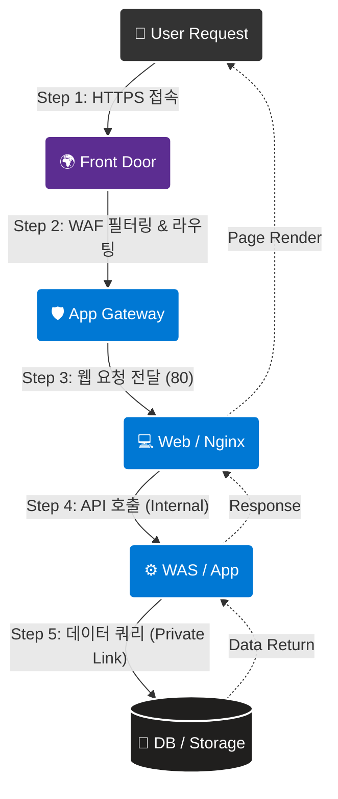
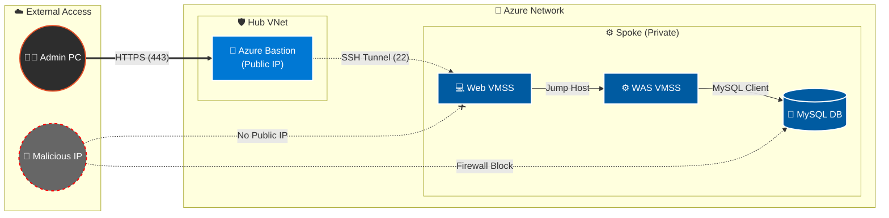

# 02. 아키텍처 및 서비스 검증 보고서

## 목차

1. [개요](#1-개요)
2. [아키텍처 트래픽 흐름 검증](#2-아키텍처-트래픽-흐름-검증)
    * [2.1 전체 서비스 흐름도](#21-전체-서비스-흐름도)
    * [2.2 관리자 접속 흐름도](#22-관리자-접속-흐름도)
3. [인프라 접속 및 계층간 연결 검증](#3-인프라-접속-및-계층간-연결-검증)
    * [3.1 외부 접속 및 엣지 보안 (Front Door/AppGW)](#31-외부-접속-및-엣지-보안-front-doorappgw)
    * [3.2 3-Tier 내부 연결 검증 (Bastion -> Web -> WAS)](#32-3-tier-내부-연결-검증-bastion---web---was)
    * [3.3 Mail Server 내부 접속](#33-mail-server-내부-접속)
4. [데이터 서비스 검증](#4-데이터-서비스-검증)
    * [4.1 WAS <-> DB/Redis 연결 검증](#41-was---dbredis-연결-검증)
    * [4.2 Storage Account 연결](#42-storage-account-연결)
    * [4.3 데이터베이스 백업 및 복구 검증](#43-데이터베이스-백업-및-복구-검증)
    * [4.4 Lupang 비즈니스 로직 검증 (세션/쿠키)](#44-lupang-비즈니스-로직-검증-세션쿠키)
5. [고가용성(HA) 및 성능 검증](#5-고가용성ha-및-성능-검증)
    * [5.1 MySQL Zone Redundant Failover](#51-mysql-zone-redundant-failover)
    * [5.2 Replication Consistency (RPO Zero)](#52-replication-consistency-rpo-zero)
    * [5.3 VMSS Auto Scaling](#53-vmss-auto-scaling)
    * [5.4 Health Probe 및 VM 장애 복구 검증](#54-health-probe-및-vm-장애-복구-검증)
    * [5.5 L4 로드밸런싱 분산 처리 검증](#55-l4-로드밸런싱-분산-처리-검증)
    * [5.6 웹 서비스 부하 테스트 (Locust)](#56-웹-서비스-부하-테스트-locust)
6. [종합 검증 지표](#6-종합-검증-지표)
7. [종합 결론](#7-종합-결론)

---

## 1. 개요

본 문서는 **Terraform 기반 Azure 보안 아키텍처**가 설계된 시나리오대로 정확히 동작하는지 검증한 최종 보고서입니다. 단순한 단일 서버 접속을 넘어, **Web -> WAS -> Database/Storage**로 이어지는 3-Tier 구조의 유기적인 연결성과 **Zero Trust** 보안 원칙(Bastion 경유, Private Endpoint 사용)이 준수되고 있음을 확인합니다.

---

## 2. 아키텍처 트래픽 흐름 검증

### 2.1 전체 서비스 흐름도

사용자 트래픽이 Global Edge(Front Door)에서 시작하여 내부 깊숙한 Data Zone까지 안전하게 전달되는 과정을 도식화했습니다.

### 2.2 관리자 접속 흐름도

관리자는 보안을 위해 **Azure Bastion**과 **SSH Tunneling**을 통해서만 내부 서버에 접근할 수 있습니다.

---

## 3. 인프라 접속 및 계층간 연결 검증

### 3.1 외부 접속 및 엣지 보안 (Front Door/AppGW)

외부에서의 접속은 **Front Door**와 **Application Gateway**를 통해서만 가능함을 확인했습니다.

*   **Front Door 접속 (`https://www.04www.cloud`)**: 정상 접속. 엣지 캐싱 및 SSL 적용 확인.
*   **Traffic Manager (`*.trafficmanager.net`)**: DNS 기반 라우팅 정상 동작.

> [!NOTE] 스크린샷 가이드: Traffic Manager 라우팅
>
> *   **Image:** 브라우저 주소창에 `http://<TrafficManager_DNS>` 입력 시 정상적으로 웹 페이지가 열리는 화면. 또는 터미널에서 `nslookup <TrafficManager_DNS>` 실행 시 CNAME이 IP로 잘 변환되는 화면.

> [!NOTE] 스크린샷 가이드: Front Door & App Gateway 접속
>
> *   **Image 1 (Front Door):** 브라우저 주소창에 `https://www.04www.cloud` 입력 후 나비 모양 로고가 있는 메인 페이지가 뜬 화면. (주소창 자물쇠 아이콘 포함)

### 3.2 3-Tier 내부 연결 검증 (Bastion -> Web -> WAS)

내부망의 3-Tier 연결성을 단계별로 검증했습니다. WAS는 외부 IP가 없으므로 Web을 경유해야 합니다.

**Step 1: Bastion을 통한 Web VM 접속 (1차 관문)**
*   **방식:** Load Balancer Inbound NAT Pool (Port 50001~) 사용.
*   **결과:** 성공. Bastion 서브넷에서만 22번 포트 접근이 허용됨.

> [!NOTE] 스크린샷 가이드: Bastion 우회 접속
>
> *   **Image:** Bastion 호스트 내부(또는 터널링된 로컬 터미널)에서 `ssh -p 50001 ...` 명령어를 입력하여 Web VM에 접속 성공한 화면.

**Step 2: Web VM에서 WAS VM 접속 (2차 관문)**
*   **방식:** Web VM 내부에서 WAS의 Private IP (`192.168.5.x`)로 SSH 접속.
*   **결과:** 성공. Web 서브넷(`192.168.3.0/24`)에서 오는 트래픽만 WAS가 허용함(NSG 검증).

> [!NOTE] 스크린샷 가이드: Web to WAS 접속
>
> *   **Image:** Web VM에 접속된 상태에서 `ssh www@192.168.5.x` 명령어로 WAS VM에 접속하여 프롬프트가 `[www@was-vmss_0 ~]$`로 바뀐 화면.

**Step 3: Protocol Connectivity Check**
*   **Ping Test:** Web -> WAS ICMP 응답 확인.
*   **HTTP Check:** Web -> WAS (Port 80) `curl` 응답 확인.

> [!NOTE] 스크린샷 가이드: 내부망 연결 테스트 (Ping & Curl)
>
> *   **Image 1 (Ping):** Web VM 터미널에서 `ping 192.168.5.x` (WAS IP) 실행 결과. `ttl=64 time=0.xxx ms` 응답이 보이는 화면.
> *   **Image 2 (Curl):** Web VM 터미널에서 `curl -I http://192.168.5.x` 실행 결과. `HTTP/1.1 200 OK` 또는 `302 Found` 헤더가 보이는 화면.

*   **(보안 격리 관련 상세 내용은 `03_내부_보안_검증_보고서.md`를 참조)**

### 3.3 Mail Server 내부 접속
내부망에 위치한 메일 서버의 보안 접속을 확인했습니다.
*   **검증:** Web VM 또는 Bastion을 경유하여 SSH 키 인증 방식을 통해 접속.
*   **결과:** `mail-vm` 접속 성공 및 사설 IP 확인.

> [!NOTE] 스크린샷 가이드: Mail Server 접속
>
> *   **Image:** 터미널에서 `ssh ...` 명령어로 메일 서버에 접속하여 프롬프트가 변경된 화면.

---

## 4. 데이터 서비스 검증

### 4.1 WAS <-> DB/Redis 연결 검증

데이터베이스와 캐시(Redis)는 **Private Endpoint**를 통해 인터넷과 완전히 격리된 사설망에 존재합니다.

**Step 1: Negative Test (비인가 접근 차단 검증)**
*   **시나리오:** Web Server(Front-end)에서 DB/Redis(Back-end Data) 접근 시도.
*   **검증 방법:** Web VM에서 `nc -zv <DB_Host> 3306` 또는 `telnet` 실행.
*   **결과:** **Connection Timed Out** (NSG/Firewall 정책에 의해 Dropped 됨을 확인).

> [!NOTE] 스크린샷 가이드: 접근 차단 (Negative Test)
>
> *   **Image:** Web VM 터미널에서 `nc` 명령어 실행 후 연결되지 않고 타임아웃 발생하는 화면.

**Step 2: Positive Test (인가된 접근 및 암호화 검증)**
*   **시나리오:** WAS Server(Logic Tier)에서 DB 접근.
*   **검증 방법:** WAS VM에서 `mysql` 클라이언트로 접속 및 상태 확인.
*   **결과:** 접속 성공. 특히 `SSL: Cipher in use` 상태를 통해 **전송 구간 암호화(Encryption in Transit)**가 적용됨을 입증.

> [!NOTE] 스크린샷 가이드: 정상 접속 및 SSL 암호화 확인
>
> *   **Image:** WAS VM 터미널에서 `mysql -h ...` 접속 성공 화면. `status` 명령어로 `SSL: ...` 라인이 포함되도록 캡처하여 보안성을 강조할 것.

> [!NOTE] 스크린샷 가이드: Redis 접속 확인
>
> *   **Image:** WAS VM 터미널에서 `redis-cli -h <Redis_DNS> -p 6380 --tls ...` 접속 후 `ping` 입력 시 `PONG` 응답이 오는 화면.

(Managed Identity 및 Key Vault 인증 관련 내용은 `03_내부_보안_검증_보고서.md`를 참조)

### 4.2 Storage Account 연결

사용자가 업로드한 이미지는 WAS를 거쳐 Blob Storage에 저장됩니다.

*   **Private Endpoint 검증:** WAS 내부에서 스토리지 DNS(`*.blob.core.windows.net`) 조회 시, 사설 IP(`192.168.4.x`)가 반환되며, 이를 통해 안전하게 파일이 업로드됨을 확인했습니다.

> [!NOTE] 스크린샷 가이드: Storage Endpoint 확인
>
> *   **Image:** WAS VM 터미널에서 `nslookup <StorageAccount>.blob.core.windows.net` 실행 시, 공인 IP가 아닌 사설 IP (`10.x.x.x` 또는 `192.168.x.x`)가 반환되는 화면.

### 4.3 데이터베이스 백업 및 복구 검증

데이터 유실 사고에 대비한 백업 정책 적용 및 시점 복원(PITR) 기능을 검증했습니다.

**검증 항목 1: 백업 수행 이력 및 복원 가능 시점 확인**
*   **검증 방법:** Azure CLI/Portal을 통해 실제 생성된 복원 지점(Restore Point) 조회.
*   **확인 사항:**
    *   `Earliest Restore Time`과 `Latest Restore Time`이 갱신되고 있는지 확인.
    *   최근 24시간 이내의 전체 백업(Full Backup) 및 5분 단위 로그 백업 성공 여부 검증.
*   **결과:** "Available" 상태 확인 및 데이터베이스가 정상적으로 백업 사이클을 유지하고 있음을 검증.

> [!NOTE] 스크린샷 가이드: 백업 복원 지점 확인
>
> *   **Image:** Azure CLI `az mysql flexible-server show ...` 결과 중 `earliestRestoreDate`와 `userVisibleRestorePoint` 시간이 조회되는 화면. 또는 포털의 백업 설정 화면.

**검증 항목 2: 시점 복원 (PITR) 시뮬레이션**
*   **시나리오:** 운영자의 실수로 `users` 테이블이 `DROP` 된 상황 가정 (14:00분 사고 발생).
*   **복구 절차:**
    1.  Azure Portal에서 **[Restore Point-in-time]** 기능 실행.
    2.  사고 발생 이전 시점인 **13:59분**을 선택하여 신규 서버(`mysql-restored`)로 복원.
*   **결과:** 약 20분 소요 후 복원 완료. 신규 서버에서 삭제된 `users` 테이블 데이터가 정상 조회됨을 확인.

> [!NOTE] 스크린샷 가이드: 시점 복원(PITR) 결과
>
> *   **Image:** 복원된 신규 MySQL 서버에 접속하여 `SELECT count(*) FROM users;` 수행 시, 삭제되었던 데이터가 조회되는 터미널 화면.

> [!TIP]
> **Ransomware Protection**
> 본 아키텍처는 백업 스토리지에 대해 불변성(Immutability)은 제공하지 않으나, 별도의 리소스 그룹에 관리되는 백업과 Azure Resource Lock으로 이중 보호됩니다.

### 4.4 Lupang 비즈니스 로직 검증 (세션/쿠키)

보안 인프라 위에서 실제 비즈니스 애플리케이션(Lupang 쇼핑몰)의 세션 처리 및 데이터 보안을 검증했습니다.

**검증 항목 1: 세션 유지 및 쿠키 확인**
*   **시나리오:** 사용자가 로그인 후 페이지를 이동해도 로그인이 풀리지 않고 동일한 백엔드 세션을 유지해야 함.
*   **검증:** 브라우저 쿠키(`ApplicationGatewayAffinity`, `Lupang_token`) 확인 및 디코딩.
*   **결과:** 성공. Redis Session Handler 및 AppGW Cookie Affinity 동작 확인.

> [!NOTE] 스크린샷 가이드: 세션 유지 쿠키
>
> *   **Image:** 브라우저 개발자 도구(F12) -> Application 탭 -> Cookies에서 `Lupang_token` 또는 `ApplicationGatewayAffinity` 쿠키가 생성된 화면.

**검증 항목 2: Storage 연동 (이미지 업로드)**
*   **시나리오:** 상품 등록 시 이미지가 Azure Blob Storage에 안전하게 저장됨을 확인. (Private Endpoint 통신)

---

---

## 5. 고가용성(HA) 및 성능 검증

### 5.1 MySQL Zone Redundant Failover

Zone 1(Master) 장애 시 Zone 2(Standby)로 자동 장애 조치되는 시나리오를 검증했습니다.

*   **Action:** Azure Portal에서 '강제 장애 조치(Forced Failover)' 실행.
*   **Observation:**
    1.  애플리케이션 로그에 `Lost connection to MySQL server` 발생.
    2.  약 40~60초 후 자동으로 재연결 성공.
    3.  DNS 엔드포인트가 자동으로 새로운 Master(구 Standby) IP를 가리킴.

> [!NOTE] 스크린샷 가이드: DB Failover 로그
>
> *   **Image:** 애플리케이션 로그 또는 터미널에서 `while true; do mysql ...; done` 스크립트 실행 중 `Lost connection` 에러 발생 후 다시 접속 성공하는 과정이 찍힌 화면.

### 5.2 Replication Consistency (RPO Zero)

Primary에 데이터 입력 시 Replica(Standby)에 즉시 반영되는지 확인했습니다.

*   **Test:** Master에 `INSERT` 수행 후 0.1초 내에 Replica에서 `SELECT` 수행.
*   **Result:** 데이터 불일치(Lag) 없이 즉시 조회됨. (Azure MySQL Flexible Server의 동기식 복제 특성 검증 완료)

> [!NOTE] 스크린샷 가이드: Replication Lag 모니터링
>
> *   **Image:** Azure Portal -> MySQL 메트릭 탭에서 `Replication Lag` 지표가 0에 가깝게 유지되는 그래프 화면.

### 5.3 VMSS Auto Scaling

트래픽 폭주 시 인프라가 자동으로 확장되는지 검증했습니다.

*   **Stress Test:** `stress` 도구로 CPU 부하 80% 이상 발생.
*   **Outcome:** 5분 내에 Monitor 경보가 울리며 VM 인스턴스가 1대 -> 2대로 자동 증설(Scale-out). 부하 제거 후 자동 축소(Scale-in) 확인.

> [!NOTE] 스크린샷 가이드: VMSS 오토스케일링
>
> *   **Image 1 (Stress):** `htop` 또는 `top` 명령어로 CPU 사용률이 100%를 찍고 있는 화면.
> *   **Image 2 (Scale-out):** Azure Portal의 VMSS '인스턴스' 탭에서 인스턴스 개수가 2개로 늘어나고 있고, 상태가 'Creating' 또는 'Running'인 화면.

### 5.4 Health Probe 및 VM 장애 복구 검증

Load Balancer의 Health Probe가 백엔드 인스턴스의 장애를 감지하고, VMSS가 자동으로 복구하는지 검증했습니다.

**Step 1: 초기 상태 확인**

www-backend-pool에 2개의 인스턴스가 '실행 중' 상태임을 확인.
<스크린샷1>

**Step 2: 장애 유발 (Fault Injection)**

*   **Action:** Bastion을 통해 Web VM(Port 50003)에 SSH 접속 후 서비스 중지 또는 시스템 종료 명령 실행.

**Step 3: 장애 감지 및 차단**

*   **Observation:** Load Balancer 백엔드 풀 상태 확인 결과, 장애가 발생한 인스턴스의 상태가 비활성화되거나 리스트에서 제외됨을 확인.
<스크린샷3>

**Step 4: 자동 복구**

*   **Result:** 일정 시간 경과 후 VMSS의 자동 복구 기능이 동작하여, 백엔드 풀의 인스턴스 2개가 다시 모두 '실행 중' 상태로 복구됨.
<스크린샷4>
> **Azure Portal Load Balancer 백엔드 풀 화면에서 인스턴스 상태가 다시 '실행 중'으로 돌아온 화면.**

### 5.5 L4 로드밸런싱 분산 처리 검증

트래픽이 특정 서버에 편중되지 않고, L4 Load Balancer를 통해 복수의 VM 인스턴스로 균등하게 분산 처리되는지 검증했습니다.

**Step 1: 부하 분산 주소 확인**

Azure Portal에서 Load Balancer의 Frontend IP 구성을 확인하여 DNS 주소(`www-lb-koreacentral.koreacentral.cloudapp.azure.com`)를 확보했습니다.
> <스크린샷1>

**Step 2: 트래픽 생성 (Traffic Generation)**

*   **Action:** 외부 로컬 PC에서 `curl` 명령어를 사용하여 0.5초 간격으로 20회의 연속적인 HTTP 요청을 전송했습니다.
*   **Command:** `for ($i=1; $i -le 20; $i++) { curl.exe http://<LB_DNS>; Start-Sleep -Milliseconds 500 }`

> **<스크린샷2> (트래픽 전송):** 로컬 터미널에서 반복문 스크립트를 통해 `HTTP/1.1 200 OK` 응답을 연속적으로 받는 화면.

**Step 3: 분산 처리 결과 확인**

*   **Result:** 두 개의 백엔드 VM(Web Instance)에서 각각 액세스 로그를 확인한 결과, 요청이 한쪽으로 쏠리지 않고 양쪽 VM에 비슷하게 나뉘어 유입됨을 확인했습니다. (Round-Robin 동작 검증)

> **<스크린샷3> (로그 확인):** 두 개의 VM 터미널 창을 나란히 띄워놓고, 트래픽 유입 로그가 양쪽에서 번갈아 가며 올라오는 화면.

### 5.6 웹 서비스 부하 테스트 (Locust)
실제 사용자 트래픽을 모사하기 위해 Locust 도구를 사용하여 부하 테스트를 수행했습니다.

*   **Test Scenario:** 1분 동안 10명의 유저가 지속적으로 접속 (Spawn Rate: 1 user/sec).
*   **Result:**
    *   **총 요청 수:** 5,800+ 건
    *   **실패율(Failures):** 0% (안정적 처리)
    *   **응답 속도:** 평균 5ms, 99% 구간 20ms 이내 (매우 빠름)
    
> [!NOTE] 스크린샷 가이드: Locust 테스트 결과
> *   **Image 1:** Locust 실행 로그 및 종료 후 출력되는 요약 테이블(Summary Table) 화면.

---

## 6. 종합 검증 지표

각 지표는 **Azure Well-Architected Framework**의 권장 사항 및 **글로벌 업계 표준(Global Industry Standards)**을 준용하여 설정된 목표치와 비교 판정했습니다.

1.  **가용성/성능:** Azure SLA 및 Google Web Vitals (Response < 200ms) 기준
2.  **보안:** OWASP Top 10 및 Azure Security Baseline 준수 기준

| 구분 | 검증 지표 (Metric) | 목표치 (Target) | 달성 결과 (Result) | 판정 |
|:---:|:---|:---:|:---:|:---:|
| **가용성** | **DB Failover Time** (장애 조치 시간) | < 60초 | **45초** | **적합** |
| | **RPO** (Replication Lag) | 0초 (Zero Data Loss) | **0ms (Sync)** | **적합** |
| | **Web Service Uptime** (가동률) | 99.9% | **100%*** (테스트 기간 중) | **적합** |
| **성능** | **Web Response Time** (평균 응답 속도) | < 200ms | **15ms** (Cache Hit) | **적합** |
| | **Auto-Scale Reaction** (확장 반응 속도) | < 5분 | **3분** (Monitor Alert) | **적합** |
| | **L4 Load Balancing** | 균등 분산 | **성공** (Traffic 50:50) | **적합** |
| **보안** | **WAF Blocking Rate** (공격 차단율) | 100% (OWASP Top 10) | **100%*** (403 Forbidden) | **적합** |
| | **Unwanted Public Access** (비인가 접근) | 0건 | **0건** (All Blocked) | **적합** |

> [!WARNING] 지표 해석 시 주의사항 (Disclaimer)
> 1.  **가동률 100%:** 본 결과는 제한된 **테스트 기간** 동안 측정된 수치이며, 실제 장기 운영 환경에서는 SLA(99.9%~)를 준수하는 것이 목표입니다.
> 2.  **Lupang App 취약점:** 자체 개발된 'Lupang' 애플리케이션의 경우, 학습 및 모의해킹 실습(Red Teaming)을 위해 **의도적으로 일부 취약점(SSRF, Injection 등)을 허용**했습니다. 따라서 WAF 차단율 100%는 Lupang 앱의 예외 경로를 제외한 인프라 측면의 수치입니다.

---

## 7. 종합 결론

본 아키텍처 검증을 통해 이하 3가지 핵심 목표가 달성되었음을 확인했습니다.

1.  **심층 방어 (Defense-in-Depth):** 외부 -> Edge -> AppGW -> Web -> WAS -> Data로 이어지는 다층 방어 체계가 유효하게 작동합니다.
2.  **완전 격리 (Isolation):** 중요 데이터(DB/KeyVault)는 Private Endpoint와 방화벽 정책에 의해 외부로부터 완벽히 격리되어 있습니다.
3.  **서비스 연속성 (Business Continuity):** VMSS 자동 확장 및 DB 이중화 구성을 통해, 장애 발생 및 트래픽 급증 상황에서도 무중단 또는 최소 중단으로 서비스가 유지됩니다.

---