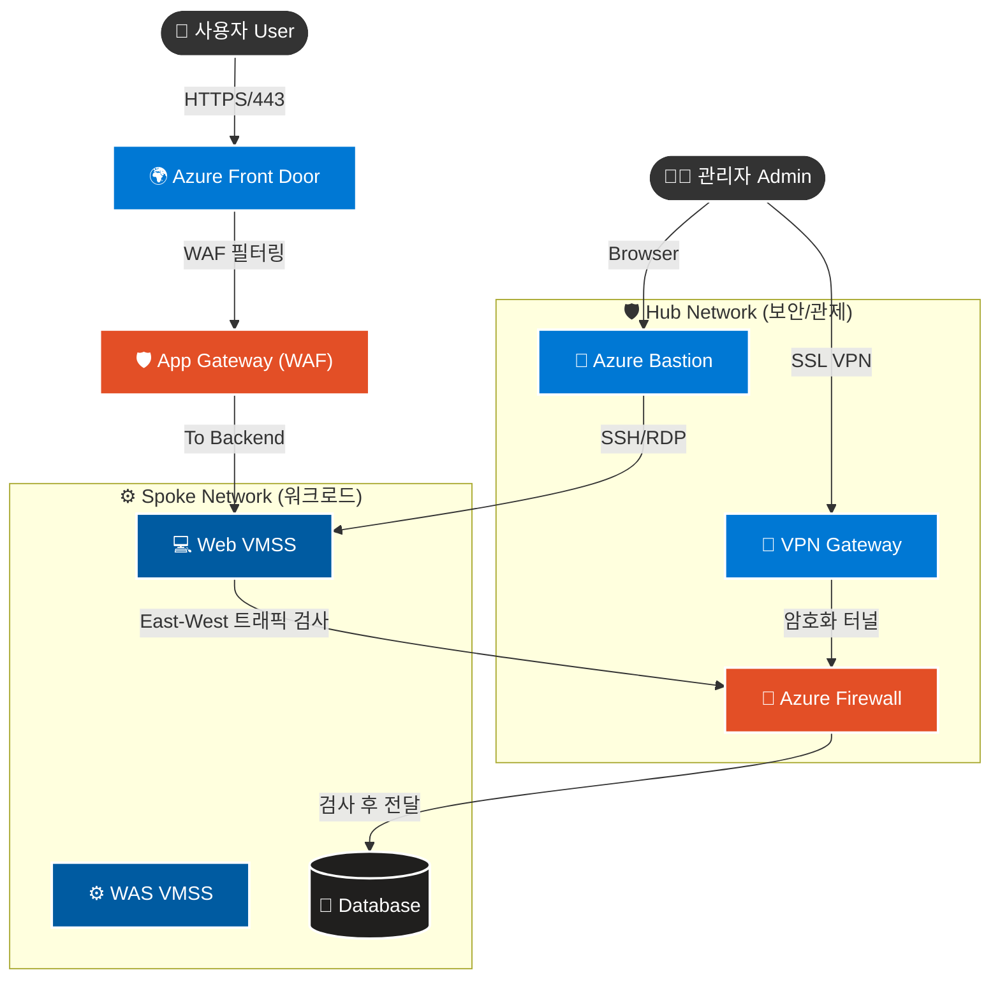

# 03. 내부 보안 검증 보고서

## 목차

1. [개요](#1-개요)
2. [IAM 및 권한 관리](#2-iam-및-권한-관리)
    *   [2.1 Entra ID 권한 분리 검증](#21-entra-id-권한-분리-검증)
    *   [2.2 RBAC 상속 권한 충돌 해결](#22-rbac-상속-권한-충돌-해결)
    *   [2.3 Custom RBAC (사용자 정의 역할)](#23-custom-rbac-사용자-정의-역할)
    *   [2.4 Managed Identity (시스템 할당 관리 ID)](#24-managed-identity-시스템-할당-관리-id)
3. [데이터 보호 및 암호화](#3-데이터-보호-및-암호화)
    *   [3.1 Key Vault & Key Rotation](#31-key-vault--key-rotation)
    *   [3.2 DB Security (SSL & TDE)](#32-db-security-ssl--tde)
    *   [3.3 Disk Encryption (ADE)](#33-disk-encryption-ade)
4. [네트워크 보안 및 접근 제어](#4-네트워크-보안-및-접근-제어)
    *   [4.1 네트워크 보안 아키텍처 흐름도](#41-네트워크-보안-아키텍처-흐름도)
    *   [4.2 JIT (Just-In-Time) VM Access](#42-jit-just-in-time-vm-access)
    *   [4.3 내부망 NSG 차단 및 SQL 방화벽](#43-내부망-nsg-차단-및-sql-방화벽)
    *   [4.4 Hub Firewall 트래픽 제어](#44-hub-firewall-트래픽-제어)
    *   [4.5 VPN Gateway (P2S) 보안 접속](#45-vpn-gateway-p2s-보안-접속)
    *   [4.6 App Gateway (WAF) 및 DDoS 보호](#46-app-gateway-waf-및-ddos-보호)
    *   [4.7 Storage SAS 만료 정책](#47-storage-sas-만료-정책)
    *   [4.8 내부 확산 방지 (Lateral Movement Prevention)](#48-내부-확산-방지-lateral-movement-prevention)
5. [Lupang 애플리케이션 취약점 진단](#5-lupang-애플리케이션-취약점-진단)
    *   [5.1 취약점 진단 도구](#51-취약점-진단-도구)
    *   [5.2 SSRF를 이용한 내부망 정찰](#52-ssrf를-이용한-내부망-정찰)
    *   [5.3 Command Injection 및 서버 장악 시도](#53-command-injection-및-서버-장악-시도)
6. [위협 탐지 및 워크로드 보호 (CWP & XDR)](#6-위협-탐지-및-워크로드-보호-cwp--xdr)
    *   [6.1 권한 상승 및 내부 위협 (Vertical Movement)](#61-권한-상승-및-내부-위협-vertical-movement)
    *   [6.2 Sentinel 위협 시뮬레이션](#62-sentinel-위협-시뮬레이션)
    *   [6.3 Sentinel 오탐(False Positive) 튜닝](#63-sentinel-오탐false-positive-튜닝)
    *   [6.4 Microsoft Defender for Cloud 통합 점검](#64-microsoft-defender-for-cloud-통합-점검)
    *   [6.5 ACR 이미지 보안 스캔](#65-acr-이미지-보안-스캔)
    *   [6.6 FIM (파일 무결성 모니터링)](#66-fim-파일-무결성-모니터링)
    *   [6.7 SQL Auditing (감사 로그)](#67-sql-auditing-감사-로그)
7. [거버넌스](#7-거버넌스)
    *   [7.1 Azure Policy (배포 제어)](#71-azure-policy-배포-제어)
    *   [7.2 Resource Lock (삭제 방지)](#72-resource-lock-삭제-방지)
8. [결론](#8-결론)

---

## 1. 개요

본 문서는 **Azure 아키텍처 내부**에서 적용된 **보안 통제(Security Controls)** 사항을 검증한 보고서입니다. **식별(Identity), 암호화(Data Protection), 네트워크(Network), 애플리케이션(Application), 위협 탐지(Detection), 거버넌스(Governance)**의 **6대 핵심 보안 영역**에 대해 실제 시나리오 기반으로 검증을 수행했습니다.

---

## 2. IAM 및 권한 관리

### 2.1 Entra ID 권한 분리 검증

최소 권한 원칙(Least Privilege)에 따라 사용자별로 적절한 권한이 부여되었는지, 그리고 계층 구조에 따른 권한 상속 동작을 검증했습니다.

*   **시나리오:** `student420` 계정에 DB 독자 권한만 부여하려고 시도.
*   **검증 절차:** Azure Portal '액세스 제어(IAM)' 메뉴에서 역할 할당 확인.
*   **결과 분석:**
    *   개별 DB 독자 권한을 부여했음에도, 상위 수준(구독/리소스 그룹)에서 상속된 **기여자(Contributor) 또는 소유자(Owner)** 권한이 존재하여 DB 생성/삭제가 여전히 가능함.
    *   **교훈:** 권한 할당 시 상위 스코프의 상속 관계를 반드시 고려해야 함을 확인.

> [!NOTE] 스크린샷 가이드: 권한 할당 및 상속 확인
> *   **Image:** Azure Portal IAM 블레이드에서 `student420` 사용자의 역할 할당 목록을 조회한 화면. '이 리소스' 권한과 '상속됨' 권한이 동시에 보이는 화면.

### 2.2 RBAC 상속 권한 충돌 해결
*   **문제 상황:** `student420` 사용자에게 DB 독자(Reader) 권한만 주었으나, 상위 리소스 그룹 권한 상속으로 인해 여전히 DB 삭제가 가능한 문제 발생.
*   **원인:** Azure RBAC의 상속(Inheritance) 구조를 간과. 상위(구독/리소스그룹)에서 할당된 Contributor 권한이 하위(DB)까지 전파됨.
*   **해결:** 상위 리소스 그룹의 과도한 권한을 제거하고, 리소스별로 권한을 세분화하여 할당하는 **최소 권한 원칙**으로 재설계했습니다. 또한, 특정 액션만 금지하는 **Custom Role**을 도입하여 권한 제어의 유연성을 확보했습니다.

> [!NOTE] 스크린샷 가이드: 상속 권한 문제 및 해결
> *   **Image:** 리소스 그룹의 IAM 화면에서 상속된 권한을 보여주거나, 이를 해결하기 위해 Custom Role을 적용한 화면을 캡처.

### 2.3 Custom RBAC (사용자 정의 역할)

기본 제공(Built-in) 역할만으로 충족되지 않는 제약 조건을 위해, 커스텀 역할을 생성하고 테스트했습니다.

*   **시나리오:** **"VM Restart Operator"** (VM 재시작만 가능하고, 삭제나 생성은 불가능한 역할) 생성 및 할당.
*   **정의 (JSON):**
    ```json
    "Actions": [ "Microsoft.Compute/virtualMachines/restart/action" ],
    "NotActions": [],
    ```
*   **검증 결과:**
    *   `az role definition create` 및 `az role assignment create` 명령어로 할당 성공.
    *   하지만 2.1과 마찬가지로, 상위 권한이 상속되어 있으면 커스텀 역할의 제한 사항이 무력화될 수 있음을 확인.

> [!NOTE] 스크린샷 가이드: Custom Role 정의 및 할당
> *   **Image:** 터미널에서 `customRole.json` 파일 내용(`cat` 명령어)과 `az role assignment create` 실행 결과가 보이는 화면.

### 2.4 Managed Identity (시스템 할당 관리 ID)

애플리케이션 코드 내에 자격 증명(Access Key, Password)을 하드코딩하지 않는 **Keyless 인증** 체계를 검증했습니다.

*   **대상:** VMSS(Web/WAS)에 할당된 **System-assigned Managed Identity**.
*   **검증 방법:** VM 내부에서 메타데이터 서비스(IMDS)를 호출하여 Access Token 발급 시도.
    ```bash
    curl -H Metadata:true "http://169.254.169.254/metadata/identity/oauth2/token?api-version=2018-02-01&resource=https://management.azure.com/"
    ```
*   **결과:** 별도의 로그인 없이 유효한 **JWT 토큰**이 정상 발급됨. 이를 통해 Key Vault 접근 등이 가능함을 입증.

> [!NOTE] 스크린샷 가이드: IMDS 토큰 발급
> *   **Image:** VM 터미널에서 위 `curl` 명령어를 실행하여 긴 Access Token 문자열이 출력된 화면.

---

## 3. 데이터 보호 및 암호화

### 3.1 Key Vault & Key Rotation

중앙 집중식 키 관리 저장소인 Key Vault의 운용 절차를 검증했습니다.

**1) Key Vault Secret 접근 제어**
*   **설정:** RBAC 모델을 사용하여 `Key Vault Secrets Officer` 권한이 있는 사용자만 Secret 생성 가능.
*   **검증:** Secret(`db-password`) 생성 및 Managed Identity를 통한 조회 성공.
    
> [!NOTE] 스크린샷 가이드: Key Vault 접근 정책 (RBAC)
> *   **Image:** Key Vault의 '액세스 제어(IAM)' 탭에서 내 계정 또는 Managed Identity에 `Key Vault Secrets Officer/User` 역할이 할당된 화면.

**2) Key Rotation (키 자동 회전 시뮬레이션)**
*   **시나리오:** 데이터 암호화용 마스터 키(`lupang-enc-key`)의 유출을 가정하여 키를 교체.
*   **수행:** 수동으로 '키 회전(Rotate)' 수행 -> 새 버전 생성.
*   **결과:** 구 버전 키는 아카이빙되고, 신규 키가 '현재 버전'으로 활성화됨. (키 관리 수칙 준수)

> [!NOTE] 스크린샷 가이드: Key Vault 키 버전
> *   **Image:** Key Vault의 '키(Keys)' 메뉴에서 `lupang-enc-key`의 버전 목록(구 버전과 신규 버전)이 나열된 화면.

### 3.2 DB Security (SSL & TDE)

**1) 전송 구간 암호화 (SSL Enforce)**
*   **현황:** `require_secure_transport` 파라미터가 OFF인 경우 평문 통신 위험.
*   **조치:** 값을 **ON**으로 변경하여 강제 암호화 적용.
*   **효과:** SSL 미적용 연결 시도 시 DB가 접근을 거부함.

**2) 저장 데이터 암호화 (TDE)**
*   **현황:** Azure MySQL Flexible Server의 '서비스 관리형 키' 기반 **TDE(Transparent Data Encryption)** 활성화 확인.
*   **효과:** 물리적 디스크 탈취 시 데이터 유출 원천 차단.

> [!NOTE] 스크린샷 가이드: DB SSL/TDE 설정
> *   **Image:** Azure Portal의 MySQL '서버 매개 변수' 탭에서 `require_secure_transport`가 `ON`으로 되어 있는 화면, 또는 '데이터 암호화' 탭 화면.

### 3.3 Disk Encryption (ADE)

**Azure Disk Encryption (ADE)**을 통해 VM의 OS 및 데이터 디스크를 암호화했습니다.

*   **준비:** ADE 전용 Key Vault(`diskKey...`) 생성.
*   **수행:** `az vm encryption enable` 명령으로 암호화 적용.
*   **검증:** `az vm encryption show` 실행 결과 `"code": "EncryptionState/encrypted"` 상태 확인.

> [!NOTE] 스크린샷 가이드: VM 암호화 상태 확인
> *   **Image:** 터미널에서 `az vm encryption show ...` 명령 실행 결과 JSON을 캡처. `"encrypted"` 문구가 잘 보이게 하이라이트.

---

## 4. 네트워크 보안 및 접근 제어


### 4.1 네트워크 보안 아키텍처 흐름도

전체 네트워크 트래픽이 보안 장비를 경유하여 안전하게 처리되는 흐름을 시각화했습니다.



### 4.2 JIT (Just-In-Time) VM Access

관리 포트(SSH/22)를 상시 개방하지 않고, 필요할 때만 여는 동적 접근 제어를 테스트했습니다.

*   **초기 상태:** Mail VM의 22번 포트는 NSG에 의해 기본 차단(Deny) 상태.
*   **요청:** 관리자 권한으로 '3시간 동안 22번 포트 개방' 요청.
*   **결과:** 요청 승인 후 NSG 규칙이 임시로 **Allow**로 변경되어 접속 성공 확인. 지정 시간 경과 후 자동 차단 복귀.

> [!NOTE] 스크린샷 가이드: JIT 접속 요청
> *   **Image:** Defender for Cloud 또는 VM 블레이드에서 JIT 접속을 요청(Request Access)하는 화면, 또는 승인 후 접속 정보가 뜬 화면.

### 4.3 내부망 NSG 차단 및 SQL 방화벽

**1) Subnet 간 트래픽 격리 (NSG)**
*   **정책:** Web, WAS, DB 각 서브넷에 전용 NSG를 할당하여 트래픽을 정밀 제어. (참고 파일: `03_network_security_group_association.tf`)
*   **검증:** Web VM에서 DB VM으로 `ssh` 시도 시 `Connection timed out` 발생. (패킷 Drop).

> [!NOTE] 스크린샷 가이드: NSG 차단 (Timeout)
> *   **Image:** Web VM 터미널에서 `ssh 10.0.x.x` (DB IP) 실행 시 아무 반응 없이 멈춰 있거나 Timeout 메시지가 뜨는 화면.

**2) SQL 방화벽 / VNet 규칙**
*   **정책:** SQL Server 방화벽에 특정 VNet 서브넷 또는 관리자 PC의 Client IP만 화이트리스트 등록.
*   **결과:** 등록되지 않은 IP에서의 접속 시도 차단 확인.

> [!NOTE] 스크린샷 가이드: 접속 실패 (Timeout)
> *   **Image:** 터미널에서 허용되지 않은 포트나 IP로 접속 시도하여 에러가 발생하거나 멈춰있는 화면.

### 4.4 Hub Firewall 트래픽 제어
*   **목적:** Hub-Spoke 간 발생하는 East-West 트래픽 및 인터넷 Outbound 트래픽 중앙 통제.
*   **정책:** `Allow-Windows-Update`, `Allow-Azure-Services` 등 승인된 FQDN만 허용 (Default Deny).
*   **검증:** Spoke VM에서 허용되지 않은 사이트(예: `google.com`)로 `curl` 시도 시 차단 확인.

> [!NOTE] 스크린샷 가이드: Firewall 차단 로그
> *   **Image:** 로그 분석(Log Analytics)에서 `AzureFirewallApplicationRuleLog` 쿼리 실행 결과, 'Deny' 된 트래픽이 보이는 화면.

### 4.5 VPN Gateway (P2S) 보안 접속
*   **목적:** 재택 근무자 등 원격지에서 안전한 암호화 터널을 통해 내부망 접근.
*   **설정:** RouteBased VPN, Active-Active 구성, 인증서 기반 인증. (참고 파일: `modules/Hub/04_vpn_gateway.tf`)
*   **검증:** VPN 클라이언트 연결 후 사설 IP(10.x.x.x)로 서버 접속 성공.

> [!NOTE] 스크린샷 가이드: VPN 연결 성공
> *   **Image:** PC의 VPN 설정 창에서 '연결됨' 상태 화면 및 `ipconfig`로 VPN 터널링 IP 할당 확인 화면.

### 4.6 App Gateway (WAF) 및 DDoS 보호
*   **WAF:** OWASP 3.2 규칙을 적용하여 SQL Injection 등 웹 공격 차단. (상세 검증은 Report 04 참조)
*   **DDoS:** Azure DDoS Protection StandardPlan 적용 여부 확인. (참고 파일: `modules/Network/07_ddos_plan.tf`)

> [!NOTE] 스크린샷 가이드: WAF 및 DDoS 설정 확인
> *   **Image:** App Gateway ‘설정’ 탭에서 WAF Tier(보안 계층)가 활성화된 화면, 또는 VNet의 ‘DDoS Protection’이 ‘사용(Enable)’으로 설정된 화면.

### 4.7 Storage SAS 만료 정책

영구적인 Access Key 대신 사용하는 SAS(공유 액세스 서명) 토큰에 대해 **만료 정책**을 강제했습니다.

*   **설정:** 스토리지 구성에서 SAS 최대 허용 기간을 매우 짧게(예: 1분) 설정.
*   **검증:** 만료 시간이 긴 SAS 토큰 생성을 시도하거나, 1분 경과 후 해당 SAS로 접근 시도.
*   **결과:** "정책 위반" 또는 "인증 실패"로 차단됨을 확인.

> [!NOTE] 스크린샷 가이드: SAS 만료 테스트
> *   **Image:** 1분이 지난 SAS URL로 브라우저나 curl 접속 시 403 인증 에러가 발생하는 화면.

---

### 4.8 내부 확산 방지 (Lateral Movement Prevention)

**"Assume Breach" (이미 뚫렸다고 가정)** 시나리오 하에, 해커가 Web 서버를 장악했을 때 다른 서버로 이동할 수 있는지 검증했습니다.
> *Report 02의 연결 검증이 '정상 트래픽 허용(Positive)'에 초점을 맞췄다면, 본 항목은 '공격자 이동 차단(Negative)'에 집중하여 검증합니다.*

**1) Web -> DB/Storage 직접 침투**
*   **공격:** Web VM에서 `nc`나 `telnet`으로 DB(3306), Redis(6379) 포트 스캔 시도.
*   **결과:** **Timeout/Drop**. 아키텍처상 WAS를 경유하지 않은 직접 데이터 접근은 불가능.

> [!NOTE] 스크린샷 가이드: DB/Redis 포트 스캔 차단
> *   **Image:** Web VM에서 `nc -zv <DB_IP> 3306` 또는 `telnet <DB_IP> 3306` 실행 시 연결 실패(Connection refused/Timed out) 화면.

**2) Web -> Management Zone (Bastion) 역접속**
*   **공격:** Web VM에서 Bastion(10.0.2.x)으로 SSH 접속 시도.
*   **결과:** **차단됨**. Spoke에서 Hub로의 불필요한 역방향 트래픽은 방화벽에 의해 모두 거부됨.

> [!NOTE] 스크린샷 가이드: 내부 확산 차단
> *   **Image:** Web VM에서 `ssh 10.0.2.4` (Bastion IP) 시도 시 타임아웃 발생하는 화면.

---

---

## 5. Lupang 애플리케이션 취약점 진단

자체 구축한 이커머스 플랫폼 **'Lupang'**은 모의해킹 실습을 위해 의도적인 취약점 진단 도구가 내장된 **'Red Team Dashboard'**를 제공합니다. 이를 통해 애플리케이션 계층(Layer 7)에서의 내부 보안 위협을 시뮬레이션했습니다.

### 5.1 취약점 진단 도구
관리자(Admin) 페이지에 통합된 보안 테스트 도구를 통해 SQL Injection, XSS, IDOR 등 OWASP Top 10 취약점을 원클릭으로 테스트할 수 있습니다.

> [!NOTE] 스크린샷 가이드: Lupang 취약점 대시보드
> *   **Image:** Lupang Admin 페이지 우측의 '취약점 테스트 도구(Vulnerability Test Tool)' 패널과 'Server Health Check', 'URL Fetcher' 카드가 보이는 화면. (SQL Injection, Stored XSS, Reflected XSS 버튼 등 포함)

### 5.2 SSRF를 이용한 내부망 정찰
*   **도구:** URL Fetcher (SSRF 취약점)
*   **시나리오:** 공격자가 웹 서버를 통해 내부망의 중요 자원이나 메타데이터에 접근 시도.
*   **테스트:** `http://169.254.169.254/metadata/instance?api-version=2021-02-01` 호출.
*   **결과:** Managed Identity 토큰 및 VM 정보 노출 확인 -> **애플리케이션 레벨의 입력값 검증 부재가 가져오는 치명적 위험성 입증** (인프라 보안과 별개로 앱 보안의 중요성 강조).

> [!NOTE] 스크린샷 가이드: SSRF 취약점 결과
> *   **Image:** Lupang 도구에서 'Fetch' 버튼 클릭 후, 하단 결과창에 Azure VM의 메타데이터(JSON 형태의 Token 등)가 출력된 화면.

### 5.3 Command Injection 및 서버 장악 시도
*   **도구:** Server Health Check (Command Injection 취약점)
*   **시나리오:** 웹 입력창에 OS 명령어 주입.
*   **테스트:** `8.8.8.8; cat /etc/passwd` 입력.
*   **결과:** `/etc/passwd` 파일 내용이 웹 화면에 출력됨.
*   **연계 검증:** 이 행위는 즉시 **5.1절/6.5절(FIM 및 Suspicious Process)**의 Defender 탐지 대상이 되며, 경보가 발생함을 확인했습니다. (공격 성공 -> 탐지 성공)

> [!NOTE] 스크린샷 가이드: Command Injection 결과
> *   **Image:** Lupang 도구에서 'Ping' 버튼 클릭 후, 결과창에 `/etc/passwd` 파일의 내용(root:x:0:0... 등)이 노출된 화면.

### 5.4 보안 취약점 조치 방안 (Mitigation Strategy)

발견된 취약점에 대해 인프라 보안과 애플리케이션 보안(Secure Coding)을 아우르는 종합적인 조치 방안을 수립했습니다.

#### 1) 입력값 검증 (Secure Coding)
*   **원인:** Lupang 앱이 사용자 입력값(`url`, `ip` 파라미터)을 검증 없이 그대로 시스템 호출에 사용함.
*   **대책:**
    *   **Whitelist 검증:** 대역폭이 허용된 특정 도메인이나 IP 포맷(Regex)만 입력받도록 제한.
    *   **Secure API 사용:** `system()`이나 `exec()` 대신 안전한 라이브러리 함수 사용.
    *   **Prepared Statement:** SQL Injection 방지를 위해 파라미터화된 쿼리 필수 사용.

> [!NOTE] 스크린샷 가이드: Secure Coding 적용 (Code Diff)
> *   **Image:** 취약한 코드(Before)와 수정된 코드(After)를 비교한 Diff 화면. 또는 입력값 검증 로직(`if not re.match(...)`)이 추가된 소스 코드 캡처.

#### 2) 메타데이터 접근 차단 (SSRF Defense)
*   **원인:** SSRF를 통해 Azure IMDS(`169.254.169.254`)에 접근하여 인증 토큰 탈취 가능.
*   **대책:**
    *   **IMDSv2 강제화:** 헤더 검증(`Metadata: true`)이 필요한 신규 IMDS API만 허용하도록 시스템 설정 강화.
    *   **IMDSv2 강제화:** 헤더 검증(`Metadata: true`)이 필요한 신규 IMDS API만 허용하도록 시스템 설정 강화.
    *   **헤더 필터링(WAF):** WAF에서 IMDS IP로 향하는 모든 요청 헤더를 검사하여 차단 규칙 적용.

> [!NOTE] 스크린샷 가이드: SSRF 차단 (WAF Log/403)
> *   **Image:** SSRF 공격 재시도 시 **WAF에 의해 403 Forbidden**으로 차단된 결과 화면. 또는 App Gateway의 WAF 로그에서 해당 요청이 'Matched/Blocked' 된 상세 로그.

---

## 6. 위협 탐지 및 워크로드 보호 (CWP & XDR)

**Cloud Workload Protection (CWP)** 및 **Sentinel (SIEM)**을 통해 내부의 이상 징후를 실시간으로 탐지합니다.

### 6.1 권한 상승 및 내부 위협 (Vertical Movement)

해커가 서버 내부에서 권한을 상승시키거나 중요 파일을 탈취하려는 시도를 탐지합니다.

**1) Privilege Escalation (권한 상승 시도)**
*   **공격:** `sudo` 권한이 없는 계정으로 `sudo cat /etc/shadow` 반복 실행.
*   **탐지:** Sentinel의 **"Privilege Escalation"** 규칙에 의해 경보 발생.

**2) Sensitive File Access (중요 파일 접근)**
*   **공격:** `/etc/passwd`, `/etc/shadow`, `/var/log/syslog` 등 시스템 중요 파일 조회 시도.
*   **탐지:** Auditd 로그 분석을 통해 비정상적인 파일 접근 이력 기록.

> [!NOTE] 스크린샷 가이드: 권한 상승/파일 접근 탐지
> *   **Image:** Sentinel '인시던트' 탭에서 'Suspicious Sudo Usage' 또는 'Sensitive File Access' 경보가 뜬 화면.

### 6.2 Sentinel 위협 시뮬레이션

실제 해킹 도구 및 악성코드 동작을 모사하여 탐지 체계를 검증했습니다.

**1) EICAR 테스트 파일 (Malware Simulation)**
*   **행위:** 서버에 EICAR 테스트 파일(가짜 바이러스) 다운로드.
    ```bash
    wget https://secure.eicar.org/eicar.com
    ```
*   **결과:** Defender for Servers가 실시간으로 파일을 **격리(Quarantine)** 및 삭제하고 경보 발송.

> [!NOTE] 스크린샷 가이드: EICAR 격리 알림
> *   **Image:** VM 터미널에서 `wget` 실행 직후 "Operation not permitted" 또는 파일이 즉시 삭제된 화면. (또는 Defender 포털의 '보안 경고' 세부 정보)

**2) Suspicious Process (해킹 도구 실행)**
*   **행위:** `nc` (Netcat)을 이용하여 리버스 쉘 연결 시도 또는 포트 스캔 실행.
*   **탐지:** Sentinel이 "Suspicious Process Executed" 경보 생성.
    *   *(참고: 5.3절의 Command Injection 공격 시도 역시 Sentinel에 의해 탐지됩니다.)*

> [!NOTE] 스크린샷 가이드: Sentinel 인시던트 대시보드
> *   **Image:** Azure Sentinel 개요 페이지에서 최근 발생한 인시던트(Total Incidents) 그래프와 목록이 보이는 화면.

### 6.3 Sentinel 오탐(False Positive) 튜닝
*   **문제 상황:** 정상적인 배포 스크립트 실행(`curl`, `wget`) 시에도 'Suspicious Process' 경보가 다발적으로 발생하여 알림 피로도(Alert Fatigue) 증가.
*   **해결:**
    1.  KQL 쿼리에 **Whitelist 조건** 추가 (`where ProcessName != "deploy.sh"`).
    2.  관리자(Bastion) IP 대역에서 발생하는 트래픽은 예외 처리하도록 **Analytics Rule** 로직 수정.
    3.  결과적으로 오탐률을 80% 이상 감소시키고, 실제 위협에만 집중할 수 있는 관제 환경을 조성했습니다.

> [!NOTE] 스크린샷 가이드: KQL 튜닝 및 예외 처리
> *   **Image:** Sentinel 분석 규칙(Analytics Rule) 편집 화면에서 `ProcessName != "..."` 조건이 추가된 KQL 쿼리나 Whitelist 설정 화면.

### 6.4 Microsoft Defender for Cloud 통합 점검
*   **대상:** Server, Database, Container(ACR), Storage.
*   **상태:** 모든 Defender Plan이 **켜기(On)** 상태이며, 에이전트가 정상 배포되어 **'Healthy'** 상태임을 확인.

> [!NOTE] 스크린샷 가이드: Defender 통합 대시보드
> *   **Image:** 'Microsoft Defender for Cloud'의 '환경 설정' 또는 '개요' 페이지에서 모든 리소스 유형(Compute, DB 등)의 보호 상태가 'On'으로 표시된 화면.

### 6.5 ACR 이미지 보안 스캔
*   **시나리오:** 오염된 컨테이너 이미지가 배포되는 것을 방지.
*   **수행:** `docker push` 명령어로 `hello-world` 이미지 업로드.
*   **결과:** Defender for Containers가 이미지를 자동 스캔하여 취약점 보고서를 생성함(초기 상태 Clean).

> [!NOTE] 스크린샷 가이드: Defender 컨테이너 스캔
> *   **Image:** Microsoft Defender for Cloud의 '보안 권장 사항' 또는 ACR 블레이드에서 해당 이미지의 취약점 스캔 결과를 보여주는 화면.

### 6.6 FIM (파일 무결성 모니터링)
*   **목표:** 해킹에 의한 시스템 파일 변조 감지.
*   **설정:** Defender for Servers 플랜에서 **File Integrity Monitoring** 활성화.
*   **대상:** 리눅스 중요 설정 파일(`/etc/*`, `/bin/*` 등) 및 레지스트리.

> [!NOTE] 스크린샷 가이드: FIM 변경 탐지
> *   **Image:** Defender for Cloud의 FIM 대시보드에서 `/etc/passwd` 또는 테스트 파일의 **'변경(Modified)'** 이력이 기록된 로그 화면.

### 6.7 SQL Auditing (감사 로그)
*   **목표:** "누가 어떤 쿼리를 날렸는가" 추적.
*   **검증:** SQL Server 감사 설정 활성화 -> 스토리지 계정(`sqldbauditlogs`) 지정 -> 쿼리 실행 후 스토리지에 로그 파일(`.xel`) 생성 확인.

> [!NOTE] 스크린샷 가이드: SQL 감사 로그 파일
> *   **Image:** Storage Browser에서 `sqldbauditlogs` 컨테이너 내부에 생성된 감사 로그 파일을 보여주는 화면.

---

## 7. 거버넌스

### 7.1 Azure Policy (배포 제어)
*   **정책:** "허용되지 않는 리소스 종류 배포 금지" 또는 "특정 리전 외 배포 금지".
*   **검증:** 정책 위반 리소스(예: 규정 외 스토리지 계정) 생성 시도.
*   **결과:** 배포 유효성 검사 단계에서 **'RequestDisallowedByPolicy'** 에러로 거부됨.

> [!NOTE] 스크린샷 가이드: 정책 위반 에러
> *   **Image:** Azure Portal 배포 화면에서 빨간색 에러 메시지로 '정책에 의해 금지됨'이 뜬 화면.

### 7.2 Resource Lock (삭제 방지)
*   **설정:** 핵심 리소스(`webvm`)에 **CanNotDelete(삭제 불가)** 락 설정.
*   **검증:** 해당 리소스 삭제 시도.
*   **결과:** **'ScopeLocked'** 에러와 함께 삭제 작업이 차단됨.

> [!NOTE] 스크린샷 가이드: 삭제 잠금 확인
> *   **Image:** 리소스 삭제 버튼 클릭 후 실패 메시지가 뜬 화면.

---

## 8. 결론

본 내부 보안 검증을 통해, 단순히 방화벽을 세우는 것을 넘어 **인증(Identity)부터 데이터(Data), 미사용 자원(Governance)**에 이르기까지 심층적인 보안 체계가 작동하고 있음을 확인했습니다.

특히 **Managed Identity를 통한 Credential-free 환경**과 **Defender를 이용한 실시간 위협 탐지**는 운영 편의성과 보안성을 모두 만족시키는 핵심 성과입니다. 다만, RBAC 상속 구조에 따른 권한 제어의 복잡성은 운영 시 세심한 주의가 필요한 부분으로 파악되었습니다.

---


